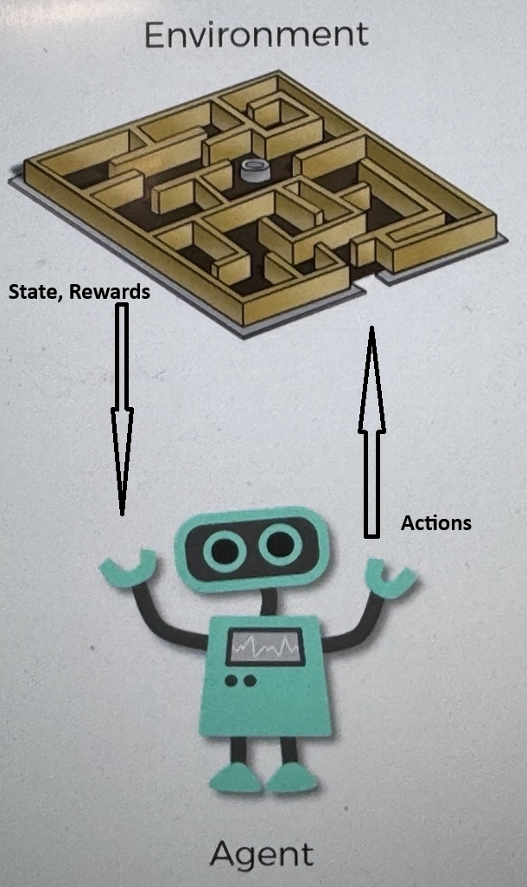

# What is Reinforcement Learning

this is just an overview of reinforcement learning

Here we have a little maze, which will be the environment

- in the environment is where we will train the AI
  - this is where the AI will be
    - performing
    - taking actions
    - looking to beat and win the environments

We also have an agent, which is going to be the AI

- this is what the AI is
  - this is what learns
- it will take actions, and as a result:

  - it will get rewards based on those actions
  - and the state will change based on the actions

- Sometimes
  - the action won't change the state
  - or it won't get a reward based on the state

Environments don't have to be a maze

- environments are just that
  - for example it could be the kitchen when you are trying to make eggs

reinforcement learning is like training a dog

- if it does what it needs to in the specific state, then you give it a reward
- if it doesn't do what you want, then you don't give it a reward

One example is spot the robot dog made by boston dynamics

- using AI to train it to walk
  - if it falls it gets a -1
  - if it walks, then +1
- using this creates the framework for it to walk properly
  - and it will optimize itself on walking

# Additional reading

[Simple reinforcement learning with Tensorflow]("https://medium.com/emergent-future/simple-reinforcement-learning-with-tensorflow-part-0-q-learning-with-tables-and-neural-networks-d195264329d0")
