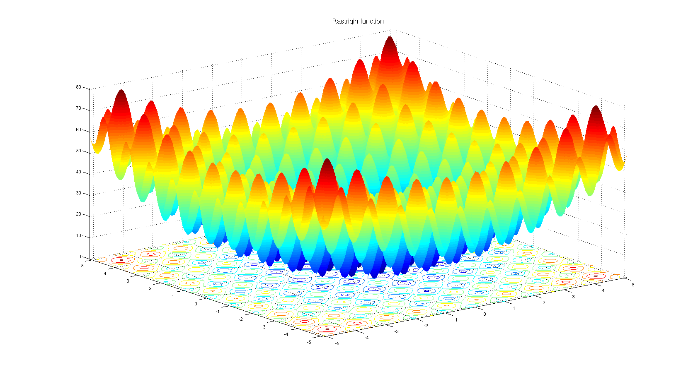
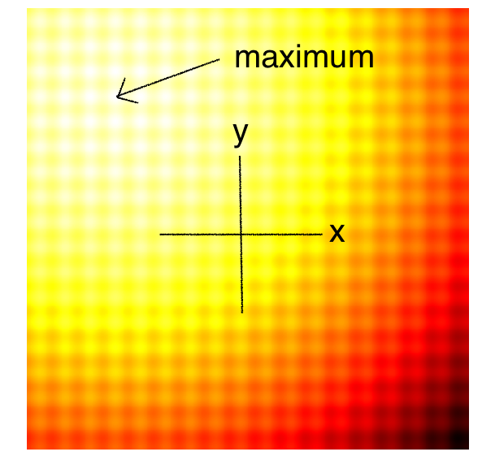
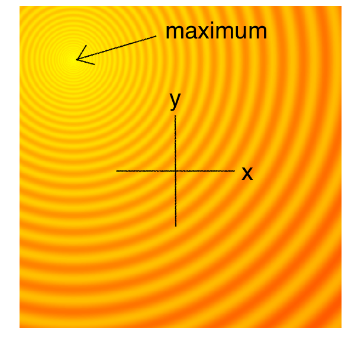

# Evolution Strategies (ES)

Evolution strategies are based on Genetic Algorithms that find the best strategies based on an objective score function

for us:

- the score is the reward
- the population of parameters are the controller matrix parameters

Evolution strategies don't use backpropagation, instead they use genetic evolution strategies

## What is an ES?

our starting point is to understand the following functions:

- Rastrigin Function:
  

- Rastrigin-2D Function
  

- Schaffer-2D Function
  

these are evaluation frameworks, that can evaluate different optimizers

- these are functions that we need to optimize/find the maximum
- these functions are not convex
  - they have a series of mountains and valleys, so classic Gradient Descent will not work in finding the global maximum, therefore we need different strategies to find them.
    - the techniques are ESs

The Rastrigin-2D function is a projection of the Rastrigin Function onto a 2D plane

- the lighter the color, the closer we are to the maximum
  - if you look at the images, there are 2 axes X and Y, the third axis (which is Z in the 3D model) is represented by the darkness of the color

what do we need to optimize?

- the x and y parameters of f(x,y) to find the maximum of f
- in the full world model:
  - y and x are actually the weights of the controller
  - f is the score function (expected cumulative reward of the agent)

this is the same with the schaffer and the schaffer-2D function

### here is the basic process of the ES

```python
solver = EvolutionStrategy()

while True: #this is to just break out of the loop

  # Step 1
  # ask the ES to give us a set of candidate solutions
  solutions = solver.ask()

  # Step 2
  # create an array to hold the fitness results.
  fitness_list = np.zeros(solver.popsize)

  # Step 3
  # evaluate the fitness for each given solution.
  for i in range(solver.popsize):
    fitness_list[i] = evaluate(solutions[i])

  # Step 4
  # give list of fitness results back to ES
  solver.tell(fitness_list)

  # Step 5
  # get best parameter, fitness from ES
  best_solution, best_fitness = solver.result()

  # Depending on the optimizer used, we will have a certain threshold (MY_REQUIRED_FITNESS), and if that is reached by best_fitness, then we break out of the loop
  if best_fitness > MY_REQUIRED_FITNESS:
    break
```

all of these pseudocode functions exist in the different optimizer functions in the ES toolkit
