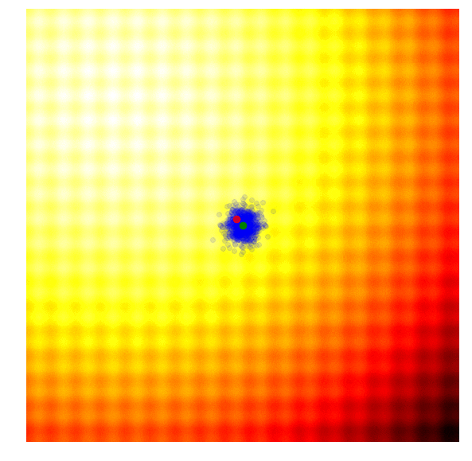
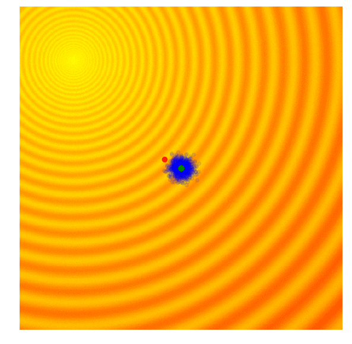

# Genetic Algorithms

## Simple Evolution strategy (SES)

This is soo simple, that it does not show up in the ES toolkit

the way it works is:

steps:

1. we start with
   - a set of solutions (x's and y's) from a normal distribution with mean μ (the Green dot)
   - a fixed standard deviation σ
2. we take the best solution within this population
   - the one that gives the highest f(x,y) (the red dot)
3. set that as our new μ, and repeat steps 1 and 2

this is not the best strategy, and it only works for simple problems. Due to its greedy nature (getting rid of all but the best solution), it can get stuck in a local optimum, instead of the global optimum

## Simple Genetic Algorithm (SGA)

this is based on Darwins theory of evolution

this is also simple, but serves to try and solve the issue of the greedy SES algorithm

The colors of the dots are the same as the SES algorithm

- the only difference is that there are more green dots.

It also works in a similar fashion to the SES algorithm, the only difference being that instead of taking the best solution, we take the best 10% of each solution sample

Terminology:

- Blue Dots : parent population
- Green Dots : offspring population

steps:

1. we start with
   - a set of solutions (x's and y's) from a normal distribution with mean μ (the Green dot)
   - a fixed standard deviation σ
2. we take the best 10% of solutions within this population, and combine their parameters to form a new solution
   - the 10% that gives the highest f(x,y) (the red dot)
   - the combination takes a cointoss to process which parent to take each parameter from
3. repeat steps 1 and 2

the combination of parameters is called _the crossover recombination and the mutation recombination_

_[this is an article that describes genetic algorithms](https://towardsdatascience.com/from-biology-to-computing-an-introduction-to-genetic-algorithms-b39476743483/)_

the best of the offspring population is selected using a fitness algorithm

the best ones are taken and crossover recombination is applied.

the way it works :

- the 2 (10%) best offspring are taken
- the parameters are split at a random point (this is called the crossover point)
- on one side if the crossover point, the genes (parameters) between them are swapped
  - the x parameters are swapped in this case, but in the full world model just the parameters on the left side of the Crossover point are swapped
- then mutation is applied
  - flipping some genes inside of some of the new offspring (less than 50% of the new population)
    - this is to prevent premature convergance of the population

_in the ES toolkit, this is the SimpleGA class_
