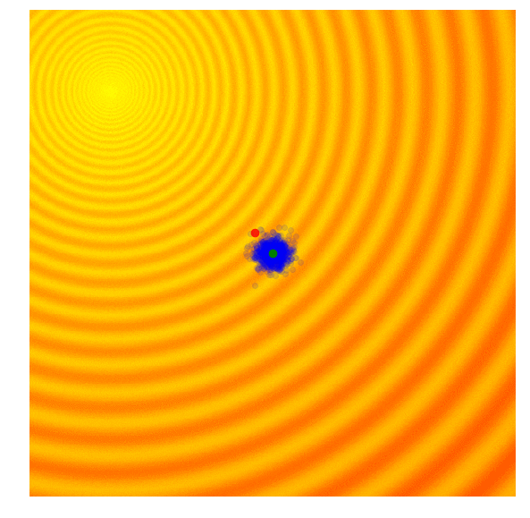
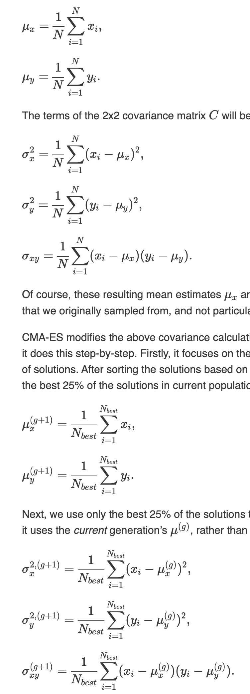

# Covariance-Matrix Adaptation Evolution Strategy (CMA-ES)

So far we have talked about Simple Evolution Strategy (SES), and Simple Genetic Algorithm (SGA), but there is an underlying issue with both of those ES's.

- Our Standard Deviation noise parameter is fixed
  - this is an issue because sometimes we want to explore more and increase the standard deviation of our search space, and sometimes we are close to the optimum, and want to lower the standard deviation

like this

#### The CMA-ES allows for a variable standard deviation

This is useful for when you have varying hill and valley shapes in your Rastrigin/Schaffer functions, it does a better job at preventing the AI from locking in at a local optima, instead of the global optima.

by far the CMA-ES is one of the best strategies for when the amount of parameters is not too high

## Math

Here is a quick refresher on Covariance Matrices

to get the mean of the x and y
- μ_x is the mean of the set of x samples
- μ_y is the mean of the set of y samples
- N is the number of Samples
- x_i and y_i are the Samles

$$ \mu_x = \frac{1}{N} \sum_{i=1}^{N} x_i $$

$$ \mu_y = \frac{1}{N} \sum_{i=1}^{N} y_i $$

to compute the variance of x and y
the terms of the 2x2 covariance Matrix C are:

$$ \sigma_x^2 = \frac{1}{N} \sum_{i=1}^{N} (x_i - \mu_x) $$

$$ \sigma_y^2 = \frac{1}{N} \sum_{i=1}^{N} (y_i - \mu_y) $$

$$ \sigma_{xy} = \frac{1}{N} \sum_{i=1}^{N} (x_i - \mu_x)(y_i - \mu_y) $$

as soon as you have the 3 sigma values, you are able to get the covariance matrix _C_

but this _C_ is not useful for our evolution strategy b/s it is an estimate of the actual covariance matrix we sampled from

what we do to solve this, is to have another covariance matrix that allows us to sample the next gen of solution parameters

this is where CMA-ES comes into play b/c  it will modify the classical computation of the Covariance matrix (_C_) by:

Change of the mean equations:
1. only keeping the top 25% solutions from the current set of solutions
2. from this 25%, it will compute the mean of the x coordinates, and also the y coordinates

Change of the standard deviation equations:
1. when computing the coefficients of _C_, instead of subtracting the mean of the x coordinates of the new gen, you subtract by the mean of the x coordinates of the current gen, and the same as the y

Now we have a "Hacked" covariance matrix

Steps in Normal words
1. Calculate the fitness score of each candidate solution in generation (g).
2. Isolate the best 25% of the population in generation (g), in purple.
3. Using only the best solutions, along with the mean μ^​(g) of the current generation (the green dot), calculate the covariance matrix C^(g+1) of the next generation.
4. Sample a new set of candidate solutions using the updated mean μ^​(g+1) and covariance matrix C​^(g+1).

the fact that CMA-ES can adjust its mean and Standard Deviation, means that it can "cast a wider net" when the global optimum is far away, or past a large Valley/Hill

