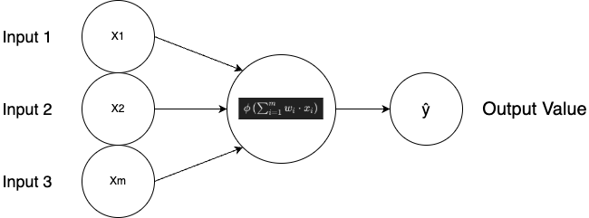

# How Do NNs Learn

There are 2 fundamentally different approaches to get a program to do what you want it to do

1. Hardcoding
2. Creating a facility for the program to understand what it needs to do on it's own

our goal is to create a network that learns on it's own

### An Example

How to distinguish between a dog and cat

##### Method 1

- Hardcode the parameters that the program needs to look at
- Cat:
  - Ears need to be Pointy
  - Nose needs to be a certain way
  - Whiskers
  - Facial Shape
  - Color
- Dog
  - Ears need to be Non Pointy
  - Nose needs to be a certain way

##### Method 2

- Code the architecture, and point the NN to a pre categorized folder of cats and dogs, and tell it to learn what a cat and dog is

### Learning

this is a single layer feed worward neural network

also called a perceptron

_the reason for the ŷ in the output instead of just Y is because y stands for the actual value, and ŷ is the output value_

#### How a Perceptron learns

- the perceptron takes in input values
- the activation functions apply
- the perceptron outputs a value

the ŷ may have a different value from the Y

if so a function (called the cost function) is calculated

- Cost Function

  - $$C = \frac{1}{2} (ŷ-y)^2$$

    _there are many different cost functions, and each has it's use case, although this is the most commonly used_

the cost function just tells us the amount of error in our prediction (ŷ)

our goal is to lower the C value of the cost function, because the lower it is, the closer ŷ is to y

once the comparison, the information from the cost function is then fed into the NN, and it goes back and updates the weights.

- the weights are the only thing that we have control over

usually the cost function value never reaches 0

#### What happens if there are many rows of data?

1 epoch is when we go through a whole dataset and train the NN on the dataset

the NN runs for each row of data, and calculated the ŷ for each row

then the cost function is implemented

this cost function becomes

- $$C = \sum \frac{1}{2} (ŷ-y)^2$$

then the weights are updated based on the C value

there are only 1 set of weights used

this is done until the C value is minimized

The whole process of training is called backpropogation
