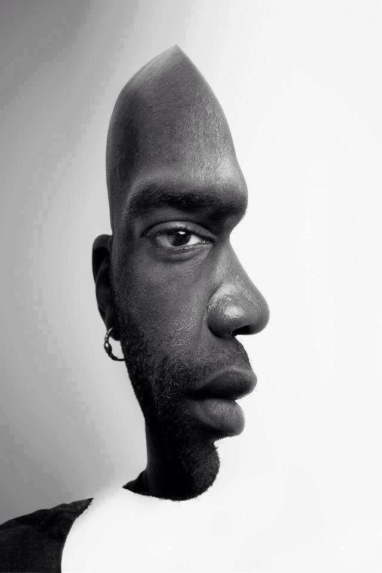
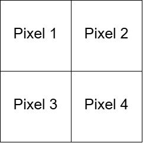
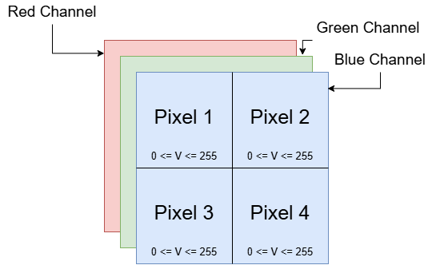
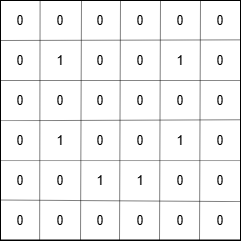

# Convolutional Neural Networks

### (CNNs)

What do you see in this image

- do you see a person looking at you?

or

- do you see a person looking to the right?

The brain sutruggles to adjust. Depending on which side of the image that you look at, the brain interprets the image in a different way

Your brain bases this judgment on features, and depending on what features you focus on, you classify it differently

How about this?

it could be an old woman with a big nose

or

it could be a young woman looking back

Finally, how about this?

it could be a duck

or

it could be a rabbit

these examples serve to show you that sometimes your brain cannot decide based on certain features.

the brain processes certain features on a certain image, or in real life.

this happens when you don't have enough time to process the features, or if you don't have enough time to process features

A CNN is similar

based on certain features that it detects, the CNN will classify an image using percentages
(Essentially a guess)

For example:

- [Cheetah](./3.18.4.jpg)

  - A CNN can classify this in the following way
    - Cheetah : 90% probability
    - Leopard : 5% Probability
    - Snow Leopard : 4% Probability
    - Egyptian Cat : 1% Probability
  - In this case the CNN was correct

- [Magnifying glass necklace](./3.18.5.jpg)
  - What this image is isn't really clear even to us. This could be a magnifying glass or a necklace
  - A CNN can classify this in the following way
    - Scissors : 95% Probability
    - Magnifying Glass : 70% Probability
    - Frying Pan : 60% Probability
    - Stethascope: 50% Probability
  - The CNN was incorrect
    - the image is not clear
    - the probabilities were not clear
    - in this case the second guess was correct

## What are CNNs

CNNs are gaining popularity, even taking over Artificial neural networks. This is because CNNs are capable of classifying images of objects. This is useful for Self driving cars, text recognition, faces, etc.

### How do CNNs work

There is an input image, it goes through the CNN, and there is an output label (Image Classification)

For example if a CNN has been trained on facial emotion recognition, then if you give it an image of a person smiling, it may categorize the image as happy. Similarly if the image os of a person frowning then it may categorize the image as sad.

it does not give a 100% categorization of the image, it will provide a percentage of the probability of what the image is.

- looking back at our previous example, it may provide a 90% chance that the image is Happy, or a 85% probability that the second image is sad.

## How is a CNN able to recognize these features?

It all starts at a basic level

let's say you have 2 images

B/W Image 2x2px

CNNs leverage the fact that this is a 2d array where each pixel has a value between 0 and 255. each pixel holds 8 bits of information (0 is black, 255 is white)

and based on this information, computers are able to work with this imformation

Colored Image 2x2px

This is a 3d array. Each pixel has 3 values, the Blue Layer/Channel (0 <= v <= 255 ), the Green Layer/Channel (0 <= v <= 255 ), the Red Layer/Channel (0 <= v <= 255 ).

finally lets look at a very trivial example of a smiling face

0 is white
, 1 is black

these 3 are the same image represented differently

(eveything is the same when you have values between 0 and 255, we just did this for simplicity's sake)

### Steps that we go through with these images are

1. Convolution
2. Max Pooling
3. Flattening
4. Full Connection

(These steps will be explained later in the course)
