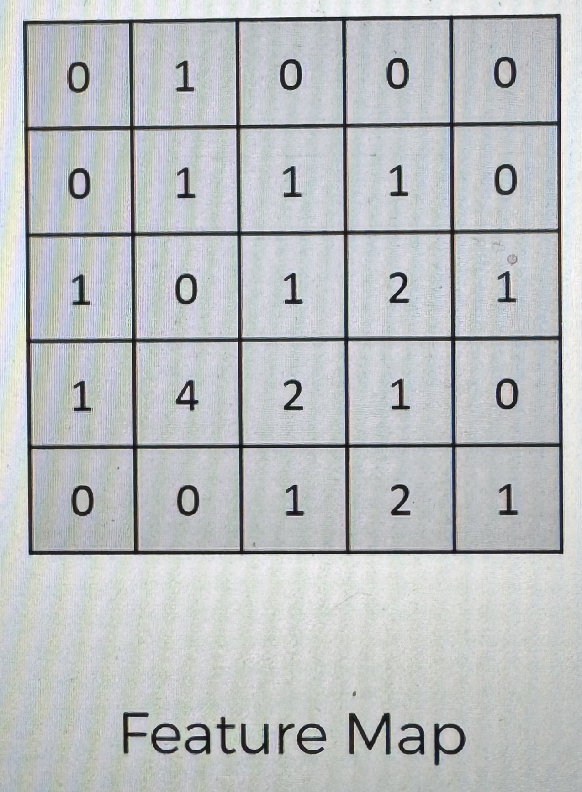

# Step 2 - Max Pooling

### What is Pooling and why do we need it?

Let's start with an example

- In the first image the cheetah is looking straight at you, and the image isn't askew
- In the second image the cheetah is looking straight at you, and the image is askew
- In the third image the cheetag is looking straight at you, but the image is streached

the thing is, we want the NN to recognize the cheetah in each image, this example uses the same image (just altered) three different times, but what if we have multiple different images of cheetahs?

we want the NN to recognize all of these cheetahs as cheetahs, and how can it do that when all of the cheetahs in the images are oriented differently, or not fully shown, or there are different image qualities?

if the NN looks for exactly a certain feature, such as the "tears" on it's face, then it may not find some cheetahs.

due to this problem, we need to make sure that the NN has a property called spacial invariance, meaning that it does not care where the features are located or a little bit different. if the features are a bit distorted, then the NN needs to have a bit of flexability to be able to still find the feature, and that is what Pooling is all about.

### How Pooling actually works

here is our feature map post convolution, so we are working with a convolution layer, now we will apply max pooling

The way it is done, is my taking the first 2x2 section of the convolution layer, find the maximum value of within that 2x2, and make that your corrsponding value in your pooled feature map

then move the box to the right by the stride (in this case 2), and repeat until the pooled feature map is complete

_in this case the final stride for the each row and the last column goes out of bounds, and only covers 2 values, that does not matter, just Max-pool the 2 values (in this case it would be 0)_

here is the final diagram after max pooling the feature map

What happened:

- with this we were still able to preserve the features (the max numbers represent where you found the closest similarity to the features)
- by pooling these features, we were able to get rid of 75% of the info that is not the feature (the important stuff)
- and since we are taking the maximum of these values (features) we are accounting for any distortion
  - this would work for the cheetah images that are different from the very first one
    - the pooled features would be the exact same in the different images
- in addition we are reducing the size by 75%, which helps in terms of processing
- we are also reducing the amount of parameters that go into the final layers of the NN, and therefore we are preventing overfitting

_it is a very important benefit of pooling that we are removing info, that way we are preventing the model from overfitting the images by disregarding the unnecessary information_

_Overfitting means creating a model that matches (memorizes) the training set so closely that the model fails to make correct predictions on new data_

### Why Max pooling

- Why a stride of 2?
- Why a size of 2x2 pixels?

  ##### [Paper that explains](http://ais.uni-bonn.de/papers/icann2010_maxpool.pdf)

### Where we are:

we have taken the input image, convoluted it to create the convolution layers, and then we pooled it to create the pooling layers
