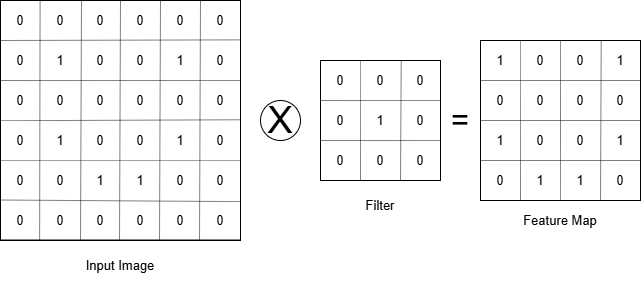

# Step 1 Convolution

The Convolution function

- $$
  (f \cdot g)(t) =
  \int_{-\infty}^{\infty} f(\tau)g(t - \tau) \, d\tau
  $$

A convolution is the combined integration of 2 functions, and it shows how 1 function modifies the shape of the other

this is used a lot in signal processing

Input image

Feature Detector

- A feature detector is a matrix, usually 3x3 (but there are other size detectors such as 5x5 or 7x7)
  - this may also be called a kernel or a filter

1. You take the feature detector, cover the top 3x3 matrix of the input image, and multiply the overlapping values, add up the result, and place it in the first section in the feature map

in this case nothing matches up, so you get a 0 in the feature map

2. then you move it over by 1, and repeat the first step till you get to the end of the row, and then place it in the next section
3. move back over to the left, and do the next row for both the feature map and the input image
4. repeat steps 2-3

the step that we move the filter is called the stride (in this case the stride is 1) conventionally the stride size that works well is 2

what have we created?

- the image on right side is called a feature map (or a convolved feature or activation map)

what have we done?

- reduced the size of the image (the size of the convolved image is based on the size of the stride)
  - this is important, since the size of an image is normally larger than 6x6, and would take longer to compute

the highest value in the feature map is usually when a feature is detected fully, it allows us to get rid of some unnessecary things that even we as humans do not process

we create multiple feature maps to create our first convolution layer, this is because we use different filters

- this is because of the way that the perceptrons learn, and each one picks up different features of the images that it is trained on

the purpose of the filter is to detect features in an input image

*https://docs.gimp.org/en/gimp-filter-convolution-matrix.html*

_if you download gimp and upload an image you can start a convolution matrix, and apply a filter_

_the edge detect filter will be the most important one for us_

most of the time the features that a NN detects and uses to classify really do not mean anything to humans
