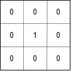

# Step 1 Convolution

The Convolution function

- $$
  (f \cdot g)(t) =
  \int_{-\infty}^{\infty} f(\tau)g(t - \tau) \, d\tau
  $$

A convolution is the combined integration of 2 functions, and it shows how 1 function modifies the shape of the other

this is used a lot in signal processing

Input image

Feature Detector

- A feature detector is a matrix, usually 3x3 (but there are other size detectors such as 5x5 or 7x7)
  - this may also be called a kernel or a filter
