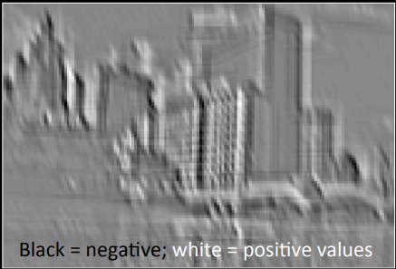
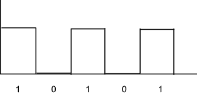

# Step 1.B - ReLU Layer

we have our input image and our convolution layer, then we apply our rectifier function

the reason we apply the Rectifier is because we want to include non linearity in our network

the reason we want to do this is because images themselves are non-linear, and when we run mathematical functions, we risk having something linear, so we apply the rectifier to make it non-linear

here is an image

when we apply a feature detector we get

when we apply the feature detector, sometimes we get negative values

what a rectified linear unit function does is remove all of the negatives, turning the previous image into the following

it may be difficult to see the benefit in terms of the benefit of this, but in the image post feature dector has a linear component when the white turns to grey, and then black. We apply the rectifier function to breakup the linearity. Essentially creating an abrupt change, essentially going from

to

recognize the first image is somewhat linear, but the second one is abrubtly changing (more so than the initial one)
