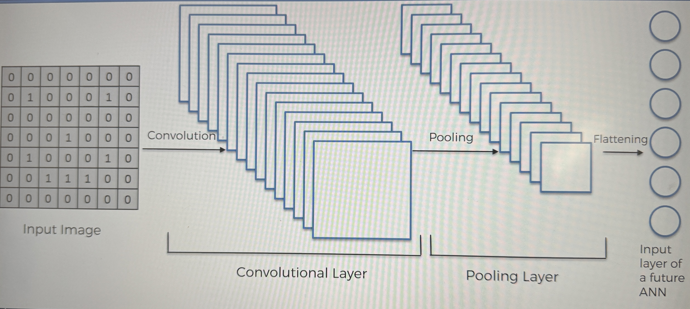

# Step 3 - Flattening

### This is a very simple step!

We take the pooled feature map, and flatten it into a column

- take the numbers row by row, and puit them into a column
  - the reason is because we want to input this into an artifical NN for further processing

_This is what it looks like when you have many pooling layers, and then you flatten them, and you get 1 large column of input vectors for an input for an Atrifical NN_

# Summary far of the steps so far

### Steps:

- Colvolute the input image
- RELu layer (rectifier linear unit)
  - Apply the rectifier function
- Pooling
- Flattening
