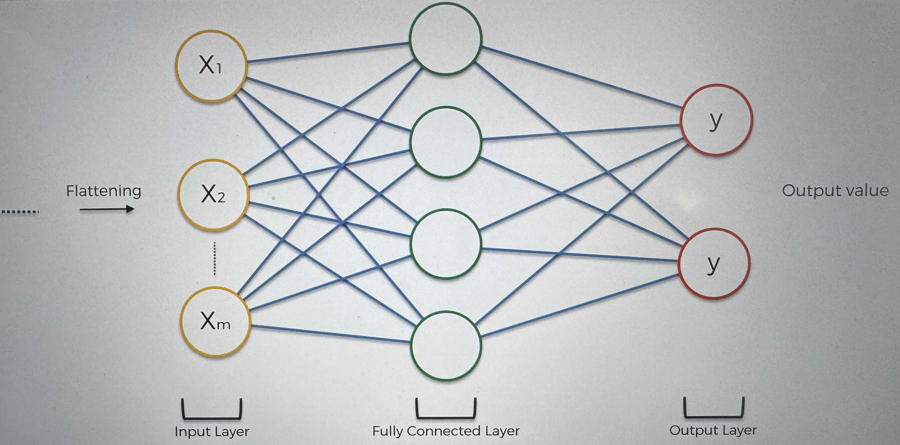
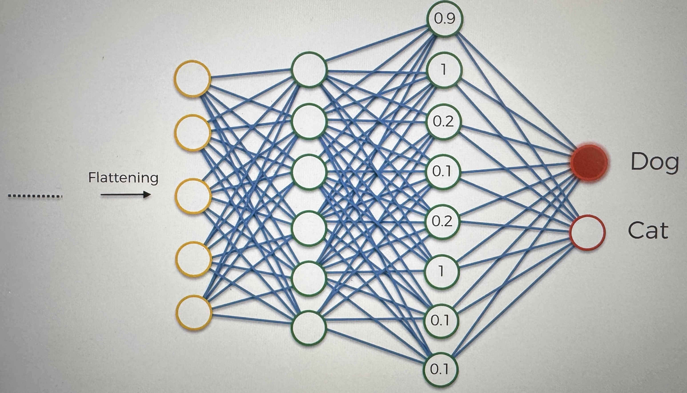
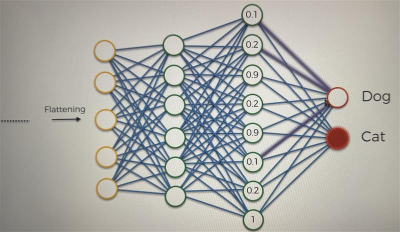

# Step 4 - Full Connection

This is the step where we add the Artificial NN to our CNN

the fully connected layers are the hidden layers in ANNs

we pass the flattened pooling layers into the input layer

the main purpose of the ANN is to combine our features into more attributes that predict the classes even better

- we already have the flattened results, which have features encoded in the numbers, and they can already do an okay job at predicting what class we are looking at
- at the same time we know that the ANN is designed to look at new attributes, and combining attributes together to even better predict things that we are trying to predict

this is a very simple example, let's look at a more realistic example

here we have a more realistic NN with the following attributes

- 5 inputs
- 6 neurons in the first hidden layer(fully connected layer)
- 8 neurons in the second hidden layer (fully connected layer)
- 2 outputs
  - 1 for dog
  - 1 for cat

Why do we have 2 outputs?

- 1 output is for when we are predicting a numerical value (when we run a regression type of problem)
- you need multiple outputs (1 per class) when you do classification
  _if you only have 2 classifications, then you can make it a binary output, but either way works_

how it works:

- we go through the steps
  - convolution
  - RELu
  - Pooling
  - flattening
- then it goes through the ANN
- then a predictions is made
  - let's say the prediction is that 80% chance it is a dog, but it is a cat
    - an error is calculated (Cost function)(in CNNs it is called a loss function)
    - then the cost is backpropogated through the ANN, and some weights and the feature detectors are adjusted to optimize the performance
      - the reason to adjust the feature detectors is that what if we are looking at the wrong features
- repeat

  - this is how it is trained

    _the data goes through the entire network, from the very start(convolution), to the very end, and then the adjustments are backpropogated throughout the network_

How do the 2 output neurons work?

How does the classification of images work out?

### starting with the dog neuron:

- we need to understand what weights to assign to the synapses that connect to the dog, to understand what is important

let's say that the numbers in the final fully connected layer

- we are looking at numbers between 1 and 0

  - 1 means that the neuron is confident it found a feature
  - 0 means that the neuron didn't find that feature

- let's say the following are the features the neurons found
  - .9 : big Nose
  - 1 : Floppy Ears
  - 1 : Eyebrows
- the Final fully connected layer relays those to both the dog and cat neurons

  - based on this inforation, the dog neuron knows it is a dog, so it triggers

    _Throughout the many iterations, the dog neuron learns that those neurons fire up when the feature belongs to a dog_

    _At the same time, the cat neuron learns that when those neurons fire up, the feature does not belong to a cat_

    _This is all based on weights assigned to those neurons_

the dog ignores the other neurons (# 3,4,5,7,8)

### Now the cat neuron

Example of a situation when it's a cat

- three neurons are close to 1, each of these neurons are connected to both the dog and the cat, and are communicating with both of the output neurons, it is up to the output neurons to decide
  - .9 : Whiskers
  - .9 : Pointy Ears
  - 1 : Non-Round Pupils
- The cat neuron uses those neurons to tell if it is a cat

that is how the final neurons learn which final fully connected layer neurons to listen to

### Post training

The output neurons look at certain final fully connected layer neurons to determine what probability that the original image being a dog or cat is

this is an example when an image of a dog is passed

Same thing happens when an image of a cat is passed, but the values will be different

in the image, the thicker lines are used to show higher weight of the synapse, for each of the output neurons
