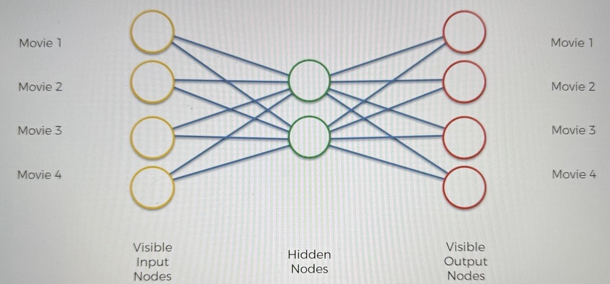
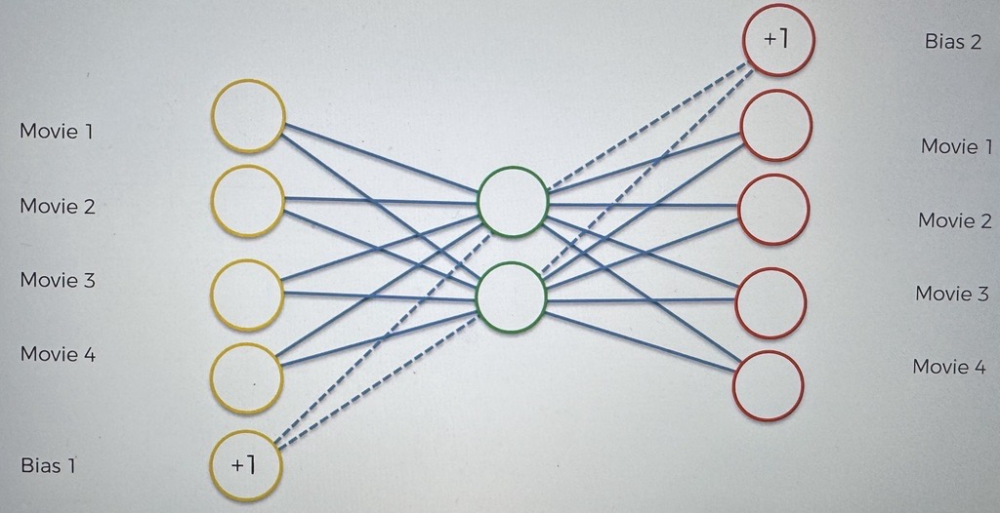
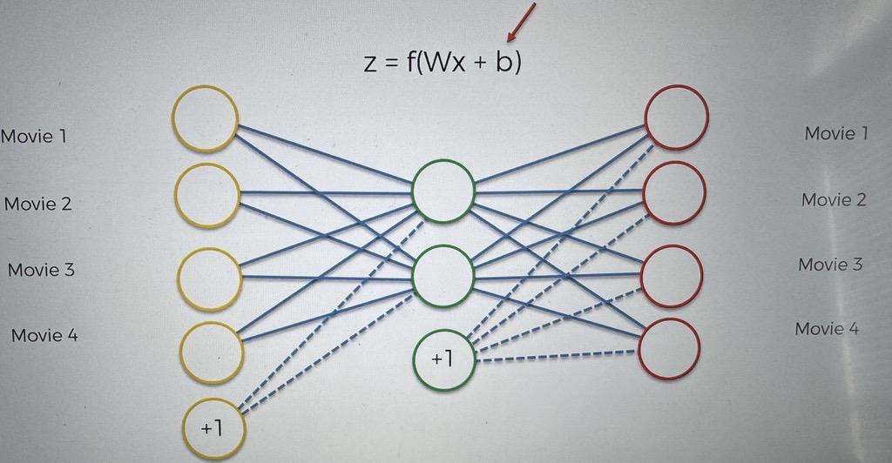

# A Note On biases

This is a quick tutorial on biases

Here we have an example of an auto encoder

Sometimes you will see a different representation of an AE:

The extra nodes are biases

Biases are just a constant value in your activation function

$$
    z = f(Wx + b)
$$

In reality, it should be shown in this format

