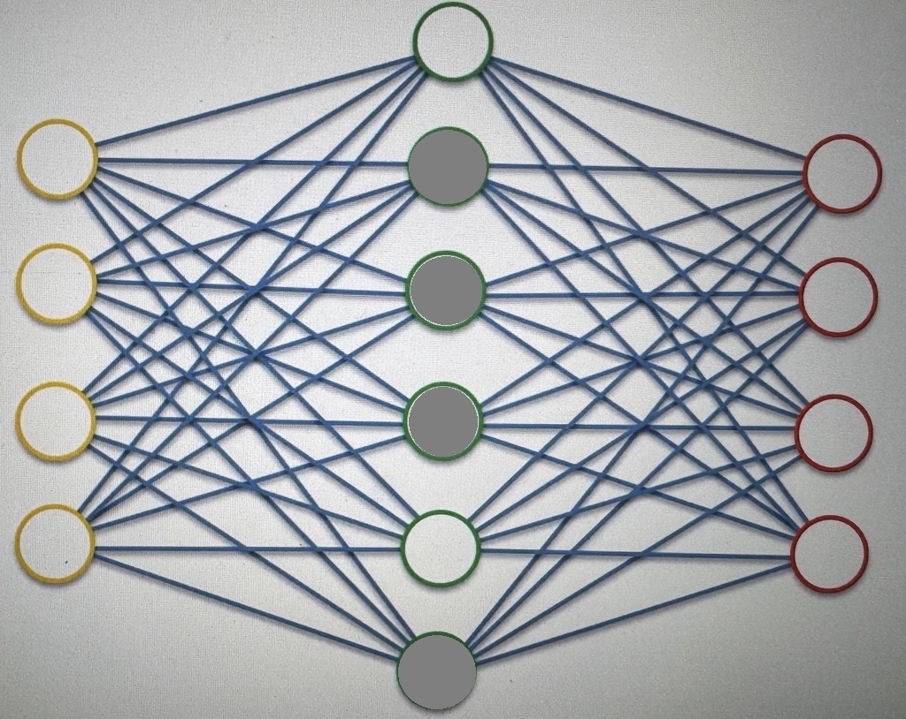

# Sparse AEs

As we previously discussed we are aiming to create an AE where the hidden layer is larger than the input layer

We are trying to extract an unrestricted amount of features

before we implement a fix, the issue of direct output of inputs still prevails, without creating a feature extraction tool

The first fix we are looking is called the Sparse AE

- This type of AE is widely used

### What is a Sparse AE (SAE)

An SAE is an AE where the Hidden Layer is larger than the input layer. but a regularization technique (RT) (which introduces sparcity) has been applied

- An RT is something that helps prevents overfitting, and/or stabilizes the algorithm

What an RT does is that it introduces a constraint/penalty on the loss function, which does not allow the AE to use all of it's hidden layer nodes, every single time

like this:

_Grey means it isn't used_

in this case only 2 hidden layer nodes are used

when the values go through, the grey nodes are outputting very insignificant values

and therefore only the non-grey nodes are outputting significant values.

the grey nodes change for different passes, and the amount of non-grey nodes should always be less than the amount of input nodes

this is so that you are extracting features at the end of the day.

it is still compressing the info, but it is just using different nodes to do so
