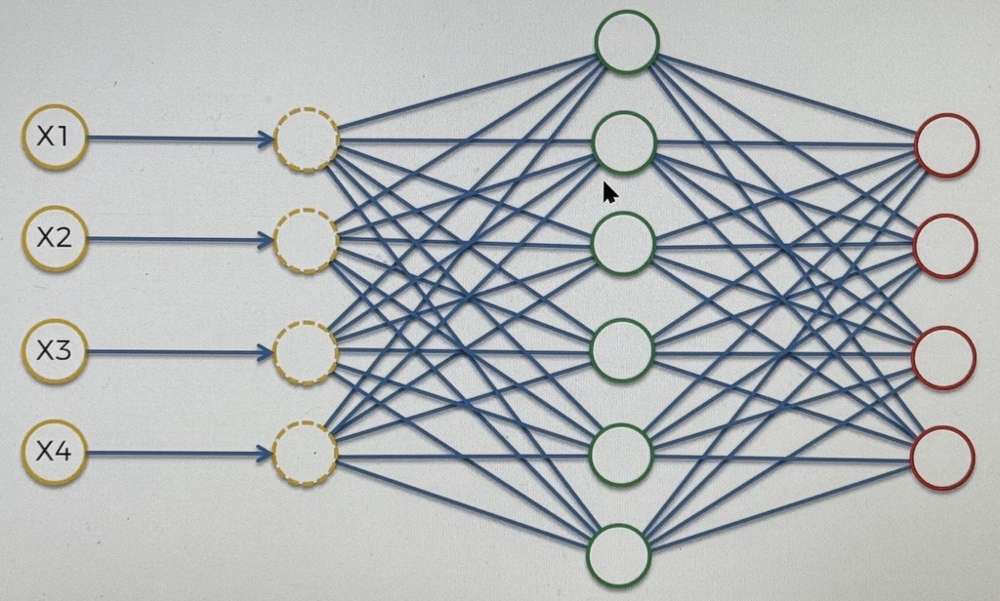
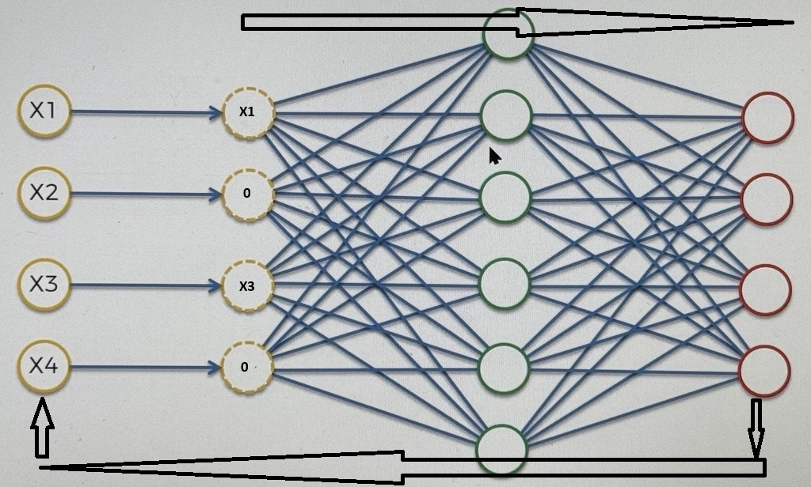

# Denoising AEs (DAE)

this is another RT, to solve the same issue from section 4.31 regarding AEs

what we do in this form is we replace the input values with a modified version of the inputs

we take the inputs, and randomly turn some of them into 0s

then once we put it through the AE, we compare the output with the original values, and that prevents the AE from directly outputting the inputs

this type of AE is a stochastic AE, it depends on the random selection of which values are 0'd out

### _This is a popular technique_
