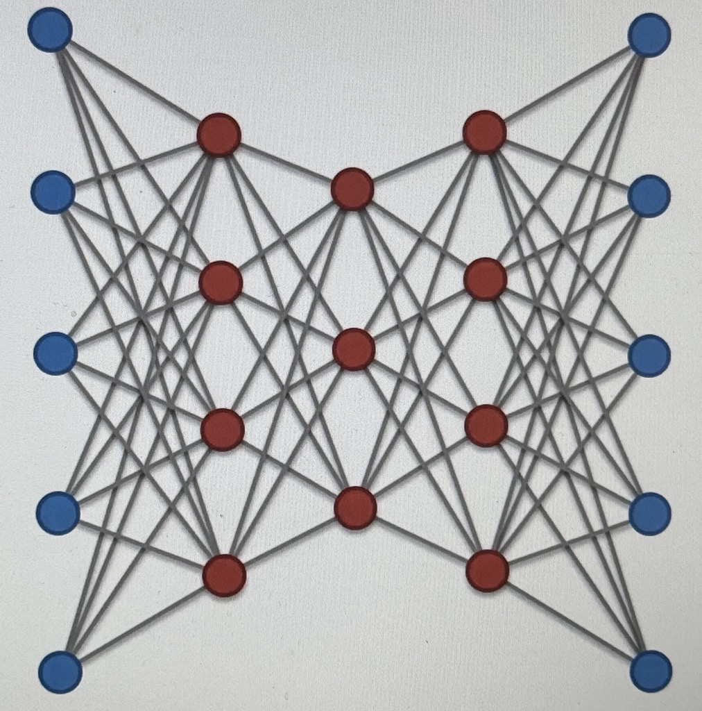

# Deep AEs (DEAE)

this is another RT, to solve the same issue from section 4.31 regarding AEs

One Thing to keep in mind is that

### _STAEs <> DEAEs_

this is apparent when you see the next image

This is a DEAE:

these are restricted Restricted Boltzmann machines

- DEAEs are Stacked, pretrained, layer-by-layer RBMs

  

DEAEs come from RBMs stacked on top of eachother

STAEs are normal AEs that are stacked
