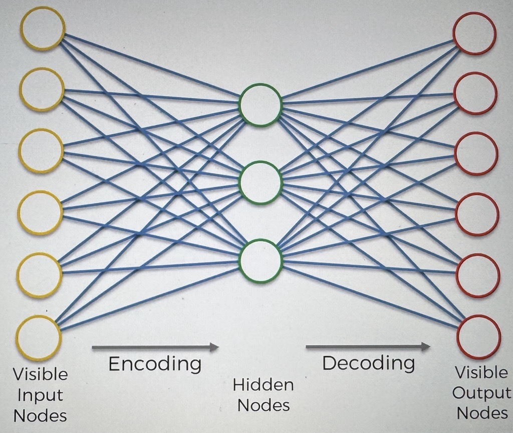
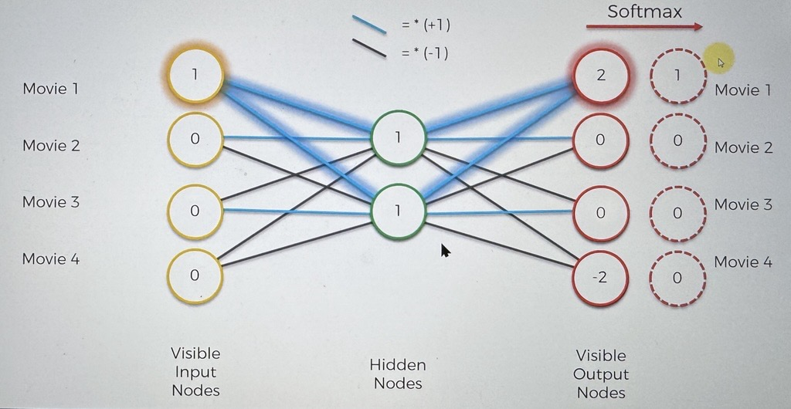

# Auto Encoders

We are in the unsupervised portion of deep learning

### What is Auto Encoding?

This is what an Auto Encoder looks like

This is a directed type of NN

An auto encoder encodes itself

- takes inputs, puts them through a hidden layer, and displays the outputs
  - it aims to make the outputs to be identical to the inputs

that is how we train the Auto Encoders (AEs)

AEs are not a purely unsupervised DL Algo

- They are actually a self supervised algorithm

here, we are looking for how to structure the encoding layer, at the same time while comparing the outputs to the inputs

### What are they used for?

- Feature detection
- Building powerful recommender systems
- Encoding

### Example

Here is an example of a simplified AE

It has :

- 4 input nodes
- 4 Output Nodes
- 2 hidden layer nodes

the inputs are movies

- These are movies that people have watched
  - we will encode the rating that people have left
    - 1 means people liked the movie
    - 0 means that they did not like the movie

the outputs are movies

this example is to prove that we can take 4 values, and encode them into 2 values, save space, and extract those features

First of all without training the AE, we will create certain weights/connections

we will color our synapses and assign operations to them

- White : a multiplication by +1
- Black : a multiplication by -1

_Normally in AEs we use the hyperbolic tan function as an activation function, but we are using 1 and -1 for example purposes_

Let's look at an input

So the person only like movie #1

the hidden nodes will have values of 1

now let's calculate the values of the output nodes

From the top node on the right
| Node | Val from Hidden Node 1 | Val from Hidden Node 2 | Calculation | Prliminary outputs |
| --- | ---- | ---- | --- | --- |
| #1 | 1 | 1 | 1 + 1 | 2 |
| #2 | 1 | -1 | 1 + -1 | 0 |
| #3 | -1 | 1 | -1 + 1 | 0 |
| #4 | -1 | -1 | -1 + -1 | -2 |

We then apply the softmax function to the preliminary outputs

    *This is Covered in 3.25*

When you apply the SoftMax Function, you get a 1 where the highest value is, and a 0 for all other values

