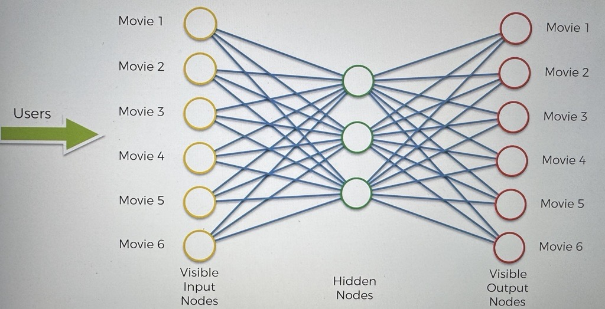
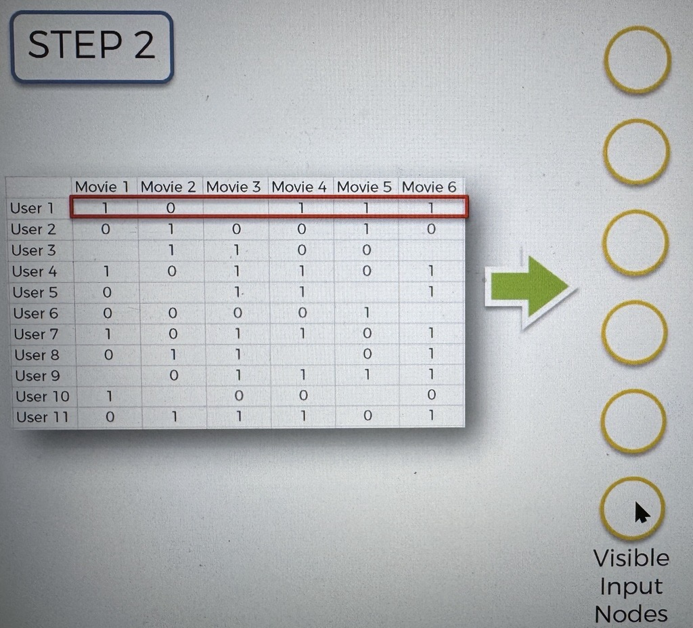
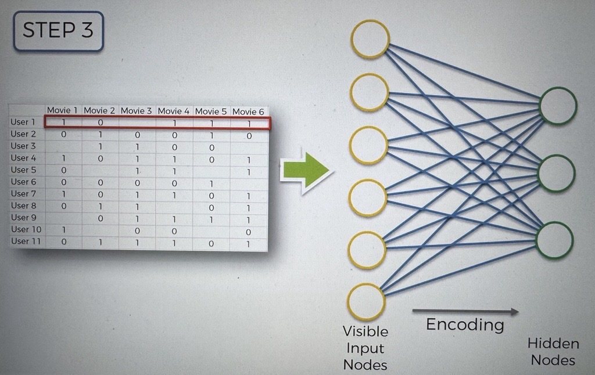
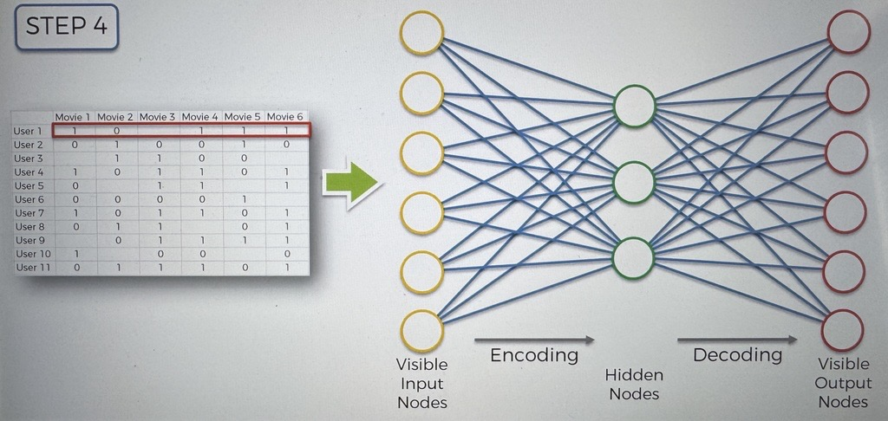
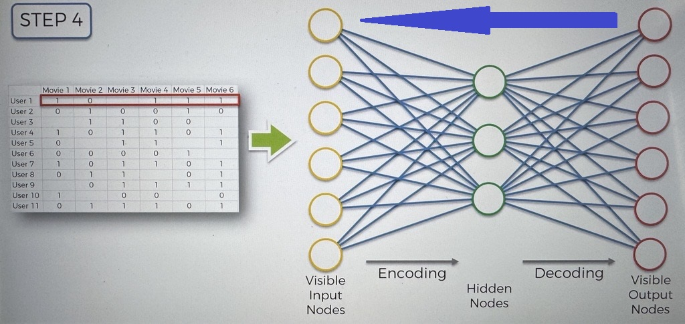

# Training an AE

Here we have an AE

Inputs:

- Ratings from alot of users for 6 movies

based on the ratings, it will create weights to allow it to encode itself to encode and decode in the future

### Training Steps

1. Start with an array where the lines (observations) correspond to the users and columns (Features) correspond to the movies. Each cell (u, i) contains the rating from 1-5 (0 if no rating) of the movie by the user u

   - i : rating

2. The first user goes into the network. The input vector x = r_1, r_2, ... , r_m) contains ratings for all of the movies, for the user

3. the input vector is encoded into a vector of z of lower dimensions by a mapping function f (eg. Sigmoid function):

   - $$ z = f(Wx + b) $$
     - where W is the vector of input weights and b is the bias

4. z is then decoded into the output vector y of same dimensions as x, aiming to replicate the input vector x

5. the reconstruction error
   $$ d(x,y) = ||x-y|| $$
   is computed, the goal is to minimize it

6. back-propagation from left to right, the error is back-propagated. the weights are adjusted according to how much they are responsible for the error. The learning rate decides by how much we update the weights

7. repeat steps 1 - 6 and update the weights after each observation (reinforcement learning) or repeat steps 1 - 6 and update the weights only after a batch of observations (batch learning)

8. when the whole training set is passed through the ANN, this makes an epoch, redo more epochs

### More Visual way of seeing steps

_In this example we are simplifying to use 1, 0, and empty, this applies to the ones using a rating from 1-5_

##### Step 1

|         | Movie 1 | Movie 2 | Movie 3 | Movie 4 | Movie 5 | Movie 6 |
| ------- | ------- | ------- | ------- | ------- | ------- | ------- |
| User 1  | 1       | 0       | 1       | 1       | 1       | 1       |
| User 2  | 0       | 1       | 0       | 0       | 1       | 0       |
| User 3  | -       | 1       | 1       | 0       | 0       |         |
| User 4  | 1       | 0       | 1       | 1       | 0       | 1       |
| User 5  | 0       | -       | 1       | 1       | 1       | 1       |
| User 6  | 0       | 0       | 0       | 0       | 1       |         |
| User 7  | 1       | 0       | 1       | 1       | 0       | 1       |
| User 8  | 0       | 1       | 1       | 0       | 1       | 1       |
| User 9  | -       | 0       | 1       | 1       | 1       | 1       |
| User 10 | 1       | -       | 0       | 0       | 0       | 0       |
| User 11 | 0       | 1       | 1       | 1       | 0       | 1       |

##### Step 2

Take the first row and put it into our AE input Nodes

##### Step 3

we calculate the hidden nodes, at the beginning we will have random weights.

This process is called encoding

##### Step 4

Calculate the visual output nodes, at the beginning we will have random weights.

This process is called decoding

##### Step 5

Compare the results from the AE to the Actual Ratings

##### Step 6

Calculate the Error, and Propagate it back through the network, and adjust the weights

##### Step 7

Repeat for all Rows

##### Step 8

1 Epoch is done, do more Epochs
