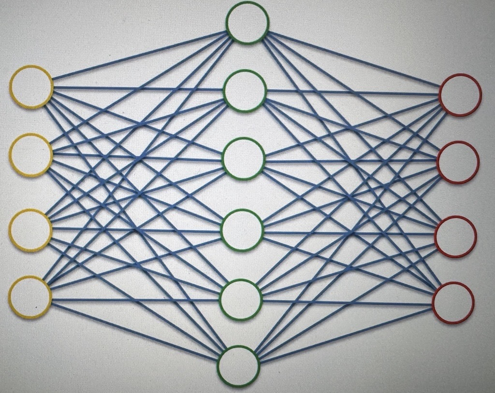
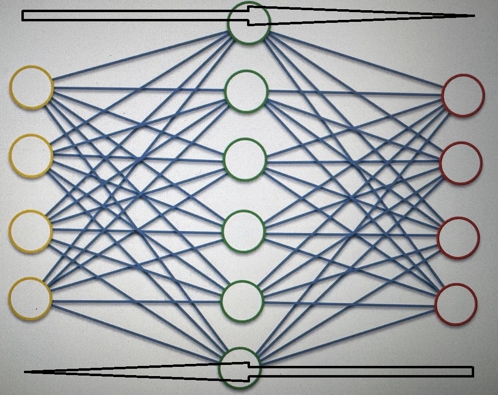

# Contractive AEs (CAE)

this is another RT, to solve the same issue from section 4.31 regarding AEs

what a CAE Does is that it leverages the whole training process, they add a penalty in the loss function that is backpropagated, not allowing the AE to copy paste the values across

This is very complex, and sometimes can get better results than DAEs in certain situations
