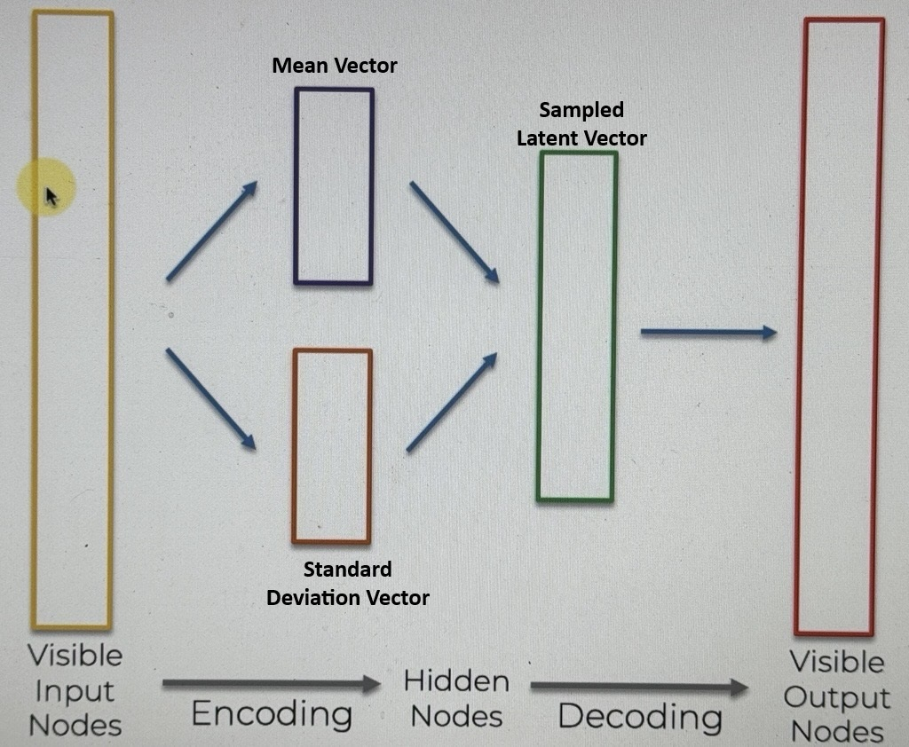

# Variational Auto Encoders (VAE)

Here is a standard AE

let's represent it in a more simple way

#### what is the difference between a normal AE and a VAE?

in a VAE we want to add some stochasticity (randomness) to the hidden nodes (latent vector). What that means is that instead of mapping our inputs onto the Latent Vector, in the VAE we will map the inputs onto a distribution (this allows us to have some randomness).

this is how we will do that.

We first map our inputs onto 2 vectors :

- The Mean Vector
  - the means go into the mean vector
- The Standard Deviation Vector
  - the standard deviations go into the standard deviation vector

from those 2 vectors we will sample our Latent vector every single time

- after this is trained, we will have a slightly varying Sampled Latend Vector every single time we generate and decode
- This allows us to acheive the stochasity we are looking for
