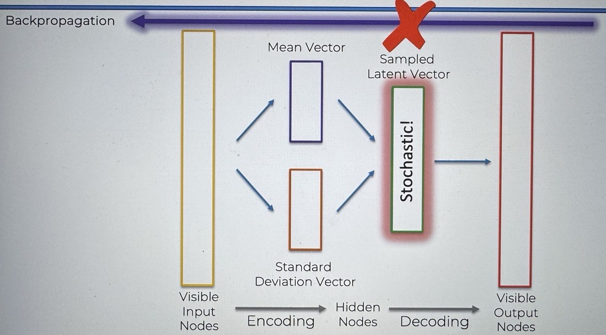

# Reparameterization trick

here we have our VAE

### Now How do we actually train a VAE?

### What happens when we run BackPropagation?

When we run backpropagation we encounter problems:

1. When it gets to the Sampled Latent Vector
   - this is due to the stochasticity in the latent Vector, and we cannot run backpropagation through this sampled latent vector
     
   - So how do we resolve this problem?
     - This is where the reparameterization trick comes into play
       - we take the sampled latent vector, and we represent it in the following way
         - $$ Z = μ + σ * ε $$
           - μ : mean vector
           - σ : Standard Deviation
           - ε : Stochastic Node
       - rather than performing stochasticity or performing the sampling in the sampled latent vector, we separate out the sampling into it's own separate node

Let's take a look at a schematical representation of this

On the left we have the original VAE

- we are taking the mean vector and standard deviation vector, and using them inside the sampled latent vector to perform the sampling of the latent vector. This is where the problem of backpropagation not being able to go through the stochasticity occurs.

On the right we have the reparameterized VAE

- what we are doing here is rather than doing the sampling within the sampled latent vector, we are separating out the sampling into its own separate node
  - ε will be the way we introduce the stochastic component into the equation, we don't actually need to train it.
  - this allows backpropagation to run through the rest of the VAE without a hitch because there is no randomness since it is separated out into its own node
