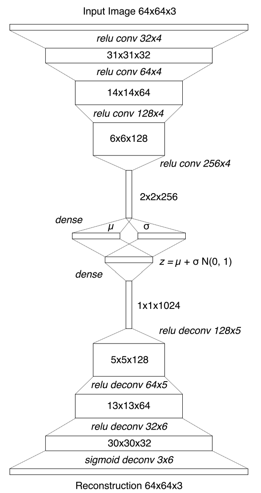

# In Section 6 We will Implement a CNN VAE

This is the plan of attack for this section


this architecture is the same as the one explained in
<a href="https://worldmodels.github.io/" target=_blank> worldmodels.github.io </a>

To run the code go to [PythonCode](./CNN-VAE.py)

Here is an image of the architecture



Here is a copy of the code

### The TensorFlow implementation

```python
###########################
# TensorFlow Version
###########################
# Building a VAE Model
###########################

# Importing the Libraries
import numpy as np
import tensorflow as tf

# Building the VAE class within a model

class ConvVAE(object):

    # Init all params and vars of the ConvVae Class
    # the default values are arbitrary
    def __init__(self, z_size=32, batch_size=1, learning_rate=0.0001, kl_tolerance=0.5, is_training=False, reuse=False, gpu_mode=False):
        # Keep the following in mind
            # Formula Z = μ + σ * ε
            # z : Stochastic AE latent vector
            # μ : mean vector
            # σ : Standard Deviation
            # ε : Stochastic Node

        # this is to initialize the variables
        self.z_size = z_size                # z_size : size of the latent vector
        self.batch_size = batch_size        # batch_size : Size of the training batches (for batch learning)
        self.learning_rate = learning_rate  # learning_rate : rate of the learning of the CNN-VAE
        self.kl_tolerance = kl_tolerance    # kl_tolerance : this is used to compute the kl-Loss
                                                # the loss we use to train the VAE will be the sum of the mean squared error loss, and the KL-Loss
        self.is_training = is_training      # is_training : mode switcher, to switch in and out of training mode
        self.reuse = reuse                  # reuse : for the variable scope of TF, True if we will reuse the Variable scope

        with tf.variable_scope('conv_vae', reuse=self.reuse):
            if not gpu_mode :               # gpu_mode: to toggle use of gpu for training
                with tf.device('/cpu:0'):
                    tf.logging.info('Model using cpu')
                    self._build_graph()
            else:
                # you don't need to set the device, because the default is to use the gpu
                tf.logging.info('Model using gpu')
                self._build_graph()
        self._init_session()

    # Writing the method that creates the VAE model architecture
    def _build_graph(self):
        # the first thing we will do before making the architecture is to init the graph
            # dynamic graphs allow faster computations of the gradients of composition functions
                # in the training computation
        self.g = tf.Graph()

        # The second thing we will do is specify that we want to have the whole architecture
            # of the VAE model inside the graph
        with self.g.as_default():
            # This is where the architecture of the VAE model goes

            # Since we are following the architecture from worldmodels
            # We will be creating the placeholder to be in the format
            # of the input images : 64 x 64 x 3
            self.x = tf.placeholder(dtype=tf.float32, shape=[None, 64, 64, 3])
                # For the shape there are 4 elements
                    # First : Dimension of the batch in this case we specify none
                    # Rest : Dimension of the images
                        # The reason the last value is 3 is because we are working
                        # with color images, if it was BW then we would use 1

############# Building the Encoder of the VAE #############

            # First convolution layer : Relu conv
            h = tf.layers.conv2d(inputs = self.x , filters = 32,
                                 kernel_size = 4, strides = 2,
                                 activation = tf.nn.relu, name = "enc_conv1")
                # For h we call the tf.layers.conv2d function, with the arguments:
                    # inputs : This is the input image
                    # filters : this is the # of feature maps/filters
                        # Since we are following the architecture from worldmodels
                        # we will set this to 32
                    # kernel_size : this is the size of the feature maps
                    # strides : stride of the feature maps
                    # activation : Activation function to use
                    # name : name of this layer

            # 2nd conv layer : relu
                # For each layer we adjust the activiation function,
                # num of filters, and filter size based on the architecture
            h = tf.layers.conv2d(inputs = h , filters = 64,
                                 kernel_size = 4, strides = 2,
                                 activation = tf.nn.relu, name = "enc_conv2")

            # 3rd conv layer : relu
            h = tf.layers.conv2d(inputs = h , filters = 128,
                                 kernel_size = 4, strides = 2,
                                 activation = tf.nn.relu, name = "enc_conv3")

            # 4th conv layer : relu
            h = tf.layers.conv2d(inputs = h , filters = 256,
                                 kernel_size = 4, strides = 2,
                                 activation = tf.nn.relu, name = "enc_conv4")

            # The next step is to flatten the result of the
            # convolutions into a 1d vector of 2x2x256 elements
            h = tf.reshape(tensor = h, shape = [-1, 2 * 2 * 256])
                # tensor : this is h (the result of all of the convolutions)
                # shape : This is the shape of the flattened tensor
                    # we set -1 as the first index of shape to specify we want
                        # it to be a single column vector
                    # 2*2*256 is the num of elements we want in the flattened vector

            # Building the V part of the VAE
                # Adding Stochasticity
                # We will sample from a factored Gaussian function
                    # We will do this by making 2 separate fully connected layers
                        # using the dense function mu and sigma
                        # Dense is the name of the class/function to build
                            # fully connected layers
                    # then using the random normal distribution by tensorflow
                    # we will sample some nums from a normal dist
                    # then we will add them to get z

            # this is to create the first fully connected layer (mu)
            self.mu = tf.layers.dense(inputs = h, units = self.z_size, name = "enc_fc_mu")
                # dense function will take 3 variables
                    # inputs : the input vector (in this case the flattened vector)
                    # units : number of neurons (based on architecture)

            # this is to create the second fully connected layer (sigma)
            self.logvar = tf.layers.dense(inputs = h, units = self.z_size, name = "enc_fc_logvar")
            self.sigma = tf.exp(self.logvar/2.0)

            # getting the Normal dist of mean 0 and variance 1
            self.epsilon = tf.random_normal([self.batch_size, self.z_size])

            # getting the batch of latent vector z's
            self.z = self.mu + self.sigma * self.epsilon

############# Building the Decoder for the VAE #############

            # First ting we need to do is make another fully connected layer
            h = tf.layers.dense(inputs = self.z, units = 1024, name = "dec_fc")
                # units is 1024 because that is the size of the output

            # Now we reshape to a 1d vector of 1x1x1024 size
            h = tf.reshape(input = h, shape = [-1 , 1 , 1 , 1024])
                # the reason for this style of dimension in shape, is to
                # make sure that we match perfectly with the architecture

            # now we invert the convolutions
            h = tf.layers.conv2d_transpose(inputs = h , filters = 128,
                                 kernel_size = 5, strides = 2,
                                 activation = tf.nn.relu, name = "dec_deconv1" )
                # this function is basically the same as the conv2d function,
                    # the only difference is that it inverses convolutions
            # repeat this for the other deconvolutions, adjusting values
                # according to the architecture
            h = tf.layers.conv2d_transpose(inputs = h , filters = 64,
                                 kernel_size = 5, strides = 2,
                                 activation = tf.nn.relu, name = "dec_deconv2" )
            h = tf.layers.conv2d_transpose(inputs = h , filters = 32,
                                 kernel_size = 6, strides = 2,
                                 activation = tf.nn.relu, name = "dec_deconv3" )
            # The following is the final reconstruction of the image
                # from the output of the CNN-VAE
            self.y = tf.layers.conv2d_transpose(inputs = h , filters = 3,
                                 kernel_size = 6, strides = 2,
                                 activation = tf.nn.sigmoid, name = "dec_deconv4" )

############# Implementing the training operations #############
    # to find and reduce the loss between the prediction (self.y) and target (self.x)
        # the loss we will use is the sum of the Mean squarred error loss a,d the KL (Kullback-Leibler) loss

            # We need to make sure we are in training (we don't want it to run all of the time)
            if (self.is_training):
                # Defining the global step of gradient descent
                    # this is to reduce the loss with the optimized gradient descent
                self.global_step = tf.Variable(initial_value=0, name='Global_step', trainable=False)
                    # Initial value : this is the first step
                    # Trainable : If True, also adds the variable to the graph collection GraphKeys.TRAINABLE_VARIABLES.
                        # This collection is used as the default list of variables to use by the Optimizer classes. Defaults to
                        # True, unless synchronization is set to ON_READ, in which case it defaults to False.

                # Now we will find the losses
                # MSE loss:
                self.r_loss = tf.reduce_sum(input_tensor = tf.square(self.x - self.y), reduction_indecies = [1,2,3]) # Calculate the sum of squared differences between the target and predictions
                    # input_tensor : tensor to reduce
                    # reduction_indecies : the dimensons to reduce (since this is a color image we use [1,2,3],
                        # if it was BW then we would use [1,2])
                        # we do not start with 0 because the first index refers to the batch in the way we have it setup
                self.r_loss = tf.reduce_mean(self.r_loss)
                    # this computes the mean of the self.r_loss

                # KL Loss:
                self.kl_loss = -.5 * tf.reduce_sum(input_tensor=(1 + self.logvar - tf.square(self.mu) - tf.exp(self.logvar)), reduction_indecies = 1)
                    # -.5 * (1 + {values in the logvar dense layer} - {values in the mu dense layer}^2 - {exponential of the values in the logvar dense layer}
                    # tf.exp : computes the exponential of each element in a tensor. The exponential function is e^x where e is Eulers number
                    # we use reduction_indecies = 1 because the dense layer only has 2 dimensions, the first corresponding to the batch
                        # and the second one corresponding to the 1D vertical tensor
                # Now we will take the max of the computed KL loss and the (kl_tolerance * z_size)
                self.kl_loss =  tf.maximum(self.kl_loss, self.kl_tolerance * self.z_size)
                    # the reason to use the max of the kl_loss and the (kl_tolerance * z_size) is because if the loss is too small, we won't have to apply the gradient
                        # this is just a trick to make it easier for us to determine if we need to apply the gradient
                # we will now compute the mean of the kl_loss if the max of the 2 is (kl_tolerance * z_size) then the mean will just be (kl_tolerance * z_size)
                    # if it is self.kl_loss, then it will take the mean of the sums of the values of the dense layers
                self.kl_loss = tf.reduce_mean(self.kl_loss)

                # Now we will sum the MSE loss and the kl loss
                self.loss = self.r_loss + self.kl_loss

                # Set learning rate
                self.lr = tf.Variable(initial_value=self.learning_rate, trainable=False)

                # Now we will set variable for the optimizer (we are using the adam optimizer) for stochastic gradient descent
                self.optimizer = tf.train.AdamOptimizer(learning_rate = self.lr)
                    # this class is already implemented in tf, and only takes the learning rate as an argument

                # Now we have everything to compute the gradient


                # Computing the Gradient on the loss (the result of the compute gradient method of the Adam Optimizer)
                grads = self.optimizer.compute_gradients(loss=self.loss)
                    # Loss : loss

                # Now we will apply the gradient on the loss to reduce it by updating the weights in our VAE based on how
                    # they contributed to the loss
                # this is how we will do it
                self.train_op = self.optimizer.apply_gradients(grads_and_vars = grads, global_step = self.global_step, name = 'Train_step')
                    # grads_and_vars: A list of (gradient, variable) pairs, where:
                        # gradient is the computed gradient for the variable.
                        # variable is the corresponding trainable variable.
                    # global_step : the global step
            # Training done

            # Now we want to init all of the global vars for the VAE
            self.init = tf.global_variables_initializer()
```

### The Keras Implementation

```python

# Importing the libraries
import numpy as np  # Importing NumPy for numerical computations
from keras.layers import Input, Conv2D, Flatten, Dense, Conv2DTranspose, Lambda, Reshape  # Importing Keras layers for building the model
from keras.models import Model  # Importing the Model class to define the neural network
from keras import backend as K  # Importing Keras backend for low-level operations
from keras.callbacks import EarlyStopping  # Importing EarlyStopping callback to prevent overfitting

# Setting the input dimensions (size of frames)
INPUT_DIM = (64,64,3)  # Defining the input shape as 64x64 RGB images (height, width, channels)

# Setting the number of convolutional filters, kernel sizes, strides, and activations per layer
CONV_FILTERS = [32,64,64,128]  # Number of filters for each convolutional layer in the encoder
CONV_KERNEL_SIZES = [4,4,4,4]  # Kernel sizes for each convolutional layer in the encoder
CONV_STRIDES = [2,2,2,2]  # Strides for each convolutional layer in the encoder
CONV_ACTIVATIONS = ['relu','relu','relu','relu']  # Activation functions for each convolutional layer in the encoder

# Setting the dense layer size
DENSE_SIZE = 1024  # Number of units in the dense layer after flattening

# Setting the layer parameters for the decoder part of the VAE
CONV_T_FILTERS = [64,64,32,3]  # Number of filters for each transposed convolutional layer in the decoder
CONV_T_KERNEL_SIZES = [5,5,6,6]  # Kernel sizes for each transposed convolutional layer in the decoder
CONV_T_STRIDES = [2,2,2,2]  # Strides for each transposed convolutional layer in the decoder
CONV_T_ACTIVATIONS = ['relu','relu','relu','sigmoid']  # Activation functions for each transposed convolutional layer in the decoder

# Setting the dimensions of the latent vectors
Z_DIM = 32  # Dimensionality of the latent space (output of the encoder)

# Setting the number of epochs and batch size
EPOCHS = 1  # Number of times the model will iterate over the entire dataset
BATCH_SIZE = 32  # Number of samples processed before updating the model’s weights

# Making a function that creates centralized latent vectors for the VAE
def sampling(args):
    z_mean, z_log_var = args  # Unpacking the mean and log variance of the latent distribution
    epsilon = K.random_normal(shape=(K.shape(z_mean)[0], Z_DIM), mean=0., stddev=1.)  # Sampling random noise from a standard normal distribution
    return z_mean + K.exp(z_log_var / 2) * epsilon  # Applying the reparameterization trick to sample from the latent space

# Building the CNN-VAE model within a class
class ConvVAE:

    # Initializing all the parameters and variables of the ConvVAE class
    def __init__(self):
        self.models = self._build()  # Building the VAE model, encoder, and decoder
        self.model = self.models[0]  # The full VAE model
        self.encoder = self.models[1]  # The encoder part of the VAE
        self.decoder = self.models[2]  # The decoder part of the VAE
        self.input_dim = INPUT_DIM  # Storing the input dimensions
        self.z_dim = Z_DIM  # Storing the latent space dimensionality

    # Building the model
    def _build(self):
        # Creating the model and the encoder inputs
        vae_x = Input(shape=INPUT_DIM)  # Defining the input tensor for the model

        # Creating the first convolutional layer of the Encoder
        vae_c1 = Conv2D(filters=CONV_FILTERS[0], kernel_size=CONV_KERNEL_SIZES[0], strides=CONV_STRIDES[0], activation=CONV_ACTIVATIONS[0])(vae_x)  # First convolutional layer

        # Creating the second convolutional layer of the Encoder
        vae_c2 = Conv2D(filters=CONV_FILTERS[1], kernel_size=CONV_KERNEL_SIZES[1], strides=CONV_STRIDES[1], activation=CONV_ACTIVATIONS[0])(vae_c1)  # Second convolutional layer

        # Creating the third convolutional layer of the Encoder
        vae_c3 = Conv2D(filters=CONV_FILTERS[2], kernel_size=CONV_KERNEL_SIZES[2], strides=CONV_STRIDES[2], activation=CONV_ACTIVATIONS[0])(vae_c2)  # Third convolutional layer

        # Creating the fourth convolutional layer of the Encoder
        vae_c4 = Conv2D(filters=CONV_FILTERS[3], kernel_size=CONV_KERNEL_SIZES[3], strides=CONV_STRIDES[3], activation=CONV_ACTIVATIONS[0])(vae_c3)  # Fourth convolutional layer

        # Flattening the last convolutional layer so we can input it in the dense layers
        vae_z_in = Flatten()(vae_c4)  # Flattening the output of the last convolutional layer

        # Using two separate files to calculate z_mean and z_log
        vae_z_mean = Dense(Z_DIM)(vae_z_in)  # Dense layer to compute the mean of the latent distribution
        vae_z_log_var = Dense(Z_DIM)(vae_z_in)  # Dense layer to compute the log variance of the latent distribution

        # Using the Lambda Keras class around the sampling function we created above
        vae_z = Lambda(sampling)([vae_z_mean, vae_z_log_var])  # Applying the sampling function to generate latent vectors

        # Getting the inputs of the decoder part
        vae_z_input = Input(shape=(Z_DIM,))  # Defining the input tensor for the decoder

        # Instantiating these layers separately so as to reuse them later
        vae_dense = Dense(1024)  # Dense layer for the decoder
        vae_dense_model = vae_dense(vae_z)  # Applying the dense layer to the latent vector

        # Reshaping the dense layer to 4 dimensions, so we can put it through the transposed convolution
        vae_z_out = Reshape((1,1,DENSE_SIZE))  # Reshape layer to prepare for transposed convolution
        vae_z_out_model = vae_z_out(vae_dense_model)  # Applying the reshape layer

        # Defining the first transposed convolutional layer
        vae_d1 = Conv2DTranspose(filters=CONV_T_FILTERS[0], kernel_size=CONV_T_KERNEL_SIZES[0], strides=CONV_T_STRIDES[0], activation=CONV_T_ACTIVATIONS[0])  # First transposed convolutional layer
        vae_d1_model = vae_d1(vae_z_out_model)  # Applying the first transposed convolutional layer

        # Defining the second transposed convolutional layer
        vae_d2 = Conv2DTranspose(filters=CONV_T_FILTERS[1], kernel_size=CONV_T_KERNEL_SIZES[1], strides=CONV_T_STRIDES[1], activation=CONV_T_ACTIVATIONS[1])  # Second transposed convolutional layer
        vae_d2_model = vae_d2(vae_d1_model)  # Applying the second transposed convolutional layer

        # Defining the third convolutional layer
        vae_d3 = Conv2DTranspose(filters=CONV_T_FILTERS[2], kernel_size=CONV_T_KERNEL_SIZES[2], strides=CONV_T_STRIDES[2], activation=CONV_T_ACTIVATIONS[2])  # Third transposed convolutional layer
        vae_d3_model = vae_d3(vae_d2_model)  # Applying the third transposed convolutional layer

        # Defining the fourth convolutional layer
        vae_d4 = Conv2DTranspose(filters=CONV_T_FILTERS[3], kernel_size=CONV_T_KERNEL_SIZES[3], strides=CONV_T_STRIDES[3], activation=CONV_T_ACTIVATIONS[3])  # Fourth transposed convolutional layer
        vae_d4_model = vae_d4(vae_d3_model)  # Applying the fourth transposed convolutional layer

        # Getting the latent vector output of the decoder
        vae_dense_decoder = vae_dense(vae_z_input)  # Applying the dense layer to the decoder input
        vae_z_out_decoder = vae_z_out(vae_dense_decoder)  # Applying the reshape layer to the decoder input
        vae_d1_decoder = vae_d1(vae_z_out_decoder)  # Applying the first transposed convolutional layer to the decoder input
        vae_d2_decoder = vae_d2(vae_d1_decoder)  # Applying the second transposed convolutional layer to the decoder input
        vae_d3_decoder = vae_d3(vae_d2_decoder)  # Applying the third transposed convolutional layer to the decoder input
        vae_d4_decoder = vae_d4(vae_d3_decoder)  # Applying the fourth transposed convolutional layer to the decoder input

        # Defining the end-to-end VAE Model, composed of both the encoder and the decoder
        vae = Model(vae_x, vae_d4_model)  # Full VAE model (encoder + decoder)
        vae_encoder = Model(vae_x, vae_z)  # Encoder model
        vae_decoder = Model(vae_z_input, vae_d4_decoder)  # Decoder model

        # Implementing the training operations
        # Defining the MSE loss
        def vae_r_loss(y_true, y_pred):
            y_true_flat = K.flatten(y_true)  # Flattening the true values
            y_pred_flat = K.flatten(y_pred)  # Flattening the predicted values
            return 10 * K.mean(K.square(y_true_flat - y_pred_flat), axis=-1)  # Computing the mean squared error (MSE) loss

        # Defining the KL divergence loss
        def vae_kl_loss(y_true, y_pred):
            return -0.5 * K.mean(1 + vae_z_log_var - K.square(vae_z_mean) - K.exp(vae_z_log_var), axis=-1)  # Computing the KL divergence loss

        # Defining the total VAE loss, summing the MSE and KL losses
        def vae_loss(y_true, y_pred):
            return vae_r_loss(y_true, y_pred) + vae_kl_loss(y_true, y_pred)  # Total VAE loss (reconstruction + KL divergence)

        # Compiling the whole model with the RMSProp optimizer, the vae loss, and custom metrics
        vae.compile(optimizer='rmsprop', loss=vae_loss, metrics=[vae_r_loss, vae_kl_loss])  # Compiling the model with the specified loss and metrics

        return (vae, vae_encoder, vae_decoder)  # Returning the VAE model, encoder, and decoder

    # Loading the model
    def set_weights(self, filepath):
        self.model.load_weights(filepath)  # Loading pre-trained weights into the model

    # Creating early stopping callbacks to prevent overfitting
    def train(self, data, validation_split=0.2):
        earlystop = EarlyStopping(monitor='val_loss', min_delta=0.0001, patience=5, verbose=1, mode='auto')  # Defining the EarlyStopping callback
        callbacks_list = [earlystop]  # Creating a list of callbacks
        self.model.fit(data, data,  # Training the model
                       shuffle=True,  # Shuffling the data
                       epochs=EPOCHS,  # Number of epochs
                       batch_size=BATCH_SIZE,  # Batch size
                       validation_split=validation_split,  # Validation split
                       callbacks=callbacks_list)  # Adding callbacks
        self.model.save_weights('vae/weights.h5')  # Saving the model weights

    # Saving the model
    def save_weights(self, filepath):
        self.model.save_weights(filepath)  # Saving the model weights to a file

    # Generating data for the MDN-RNN
    def generate_rnn_data(self, obs_data, action_data):
        rnn_input = []  # List to store RNN inputs
        rnn_output = []  # List to store RNN outputs
        for i, j in zip(obs_data, action_data):  # Iterating over observation and action data
            rnn_z_input = self.encoder.predict(np.array(i))  # Encoding observations into latent vectors
            conc = [np.concatenate([x,y]) for x, y in zip(rnn_z_input, j.reshape(-1, 1))]  # Concatenating latent vectors with actions
            rnn_input.append(conc[:-1])  # Appending RNN inputs
            rnn_output.append(np.array(rnn_z_input[1:]))  # Appending RNN outputs
        rnn_input = np.array(rnn_input)  # Converting RNN inputs to a NumPy array
        rnn_output = np.array(rnn_output)  # Converting RNN outputs to a NumPy array
        print("Rnn inputs size: {}".format(rnn_input.shape), " Rnn outputs size: {}".format(rnn_output.shape))  # Printing the shapes of RNN inputs and outputs
        return (rnn_input, rnn_output)  # Returning RNN inputs and outputs

```

_This is not the full world Model this is just the CNN-VAE, we still have to implement the MDN-RNN, the theory will be in the next section_
