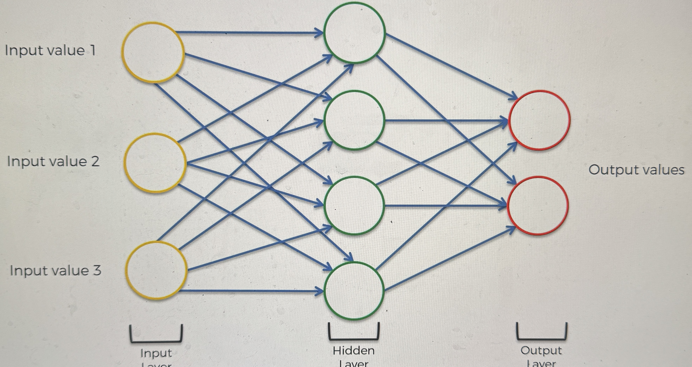
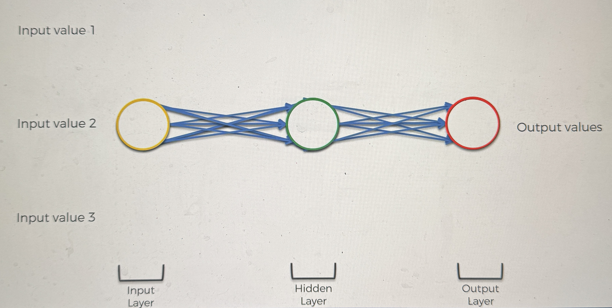
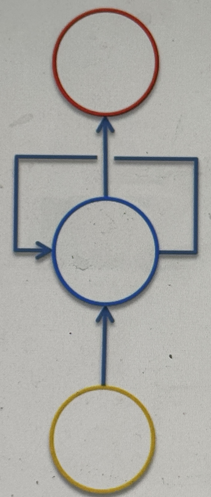
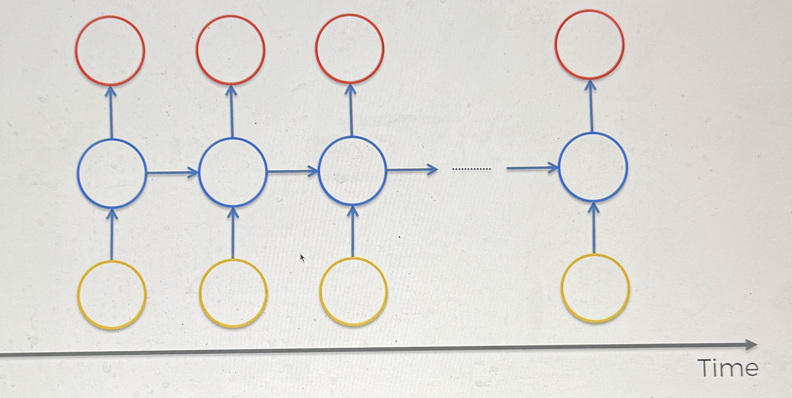
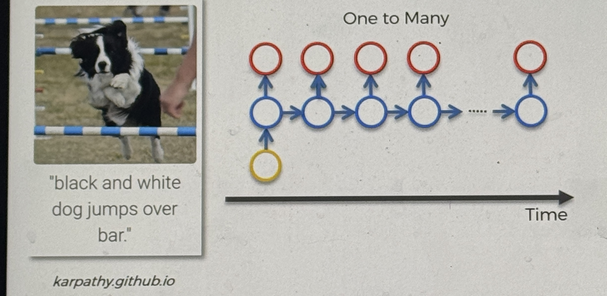
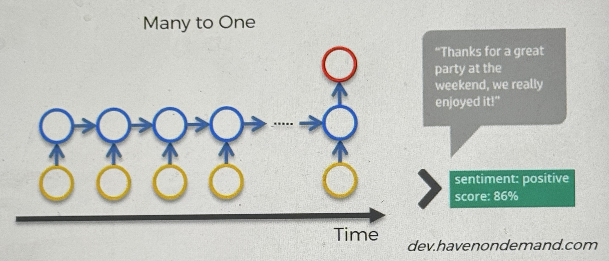
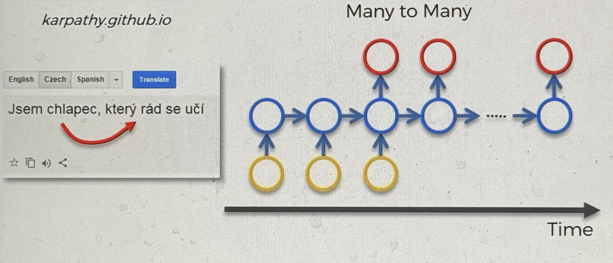

# Recurrent Neural Networks (RNNs)

### What are RNNs

RNNs are a supervised type of NN, typically used for time series analysis

The ANN in terms of the human brain

- since it uses weights, which correponds to the long term memory
- it is similar top the temporal lobe

The CNN in terms of the human brain

- since CNNs deals with vision, it would be the occipital lobe

The RNN in terms of the human brain

- it is like short term memory
- it is similar to the frontal lobe

Here we have a simple ANN

How do we transform this into an RNN?

we squash it all together like so:

think of it as if we are looking at the ANN from the bottom

We are adding a new dimension to it, all of the neurons are still there

then we display the arrow groups as just a single arrow, the hidden layer is now blue, and we add a recursive element

the line that loops the hidden layer is called the temporal loop, this just means the hidden layer not only gives an output, but also feeds back into itself

the common approach now to diagram RNNS is this:

all og the neurons are still there from the ANN, the concept is that they neurons are connecting to themselves through time

Kind of like they have some sort of short term memory

### Examples

one to many relationship

- This is where you have 1 input and multiple outputs

- this is an example where the computer describes the image

Many to one relationship

- an example is sentiment analysis, when you have alot of text, and need to gauge if it is positive or not

- Multiple inputs 1 output

Many to Many relationship

- An example would be translation
- another example would be Subtitling movies, although in a diagram each node would have an input and output
