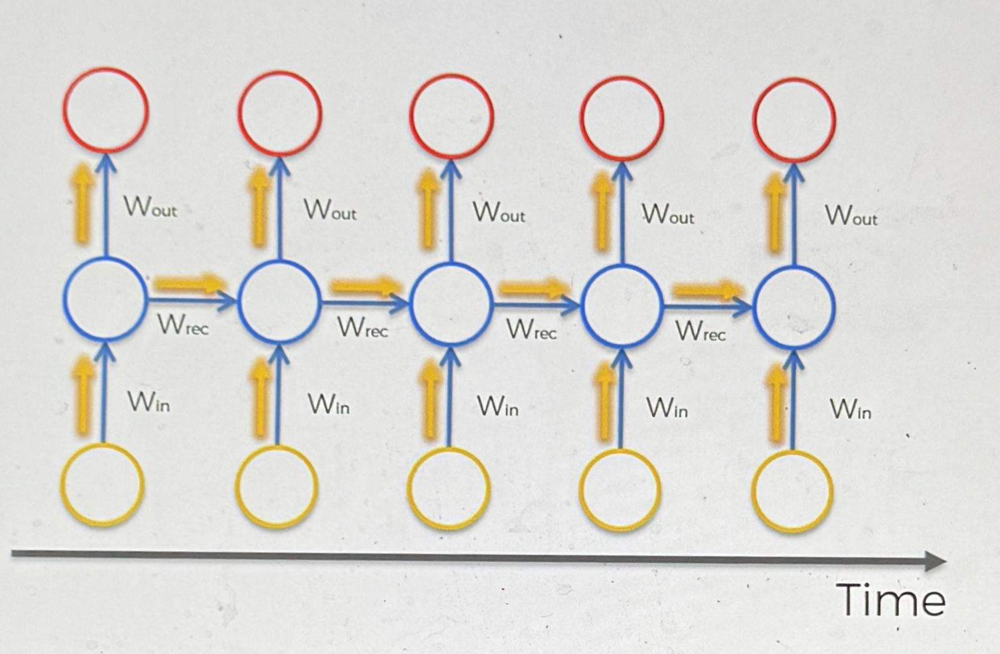
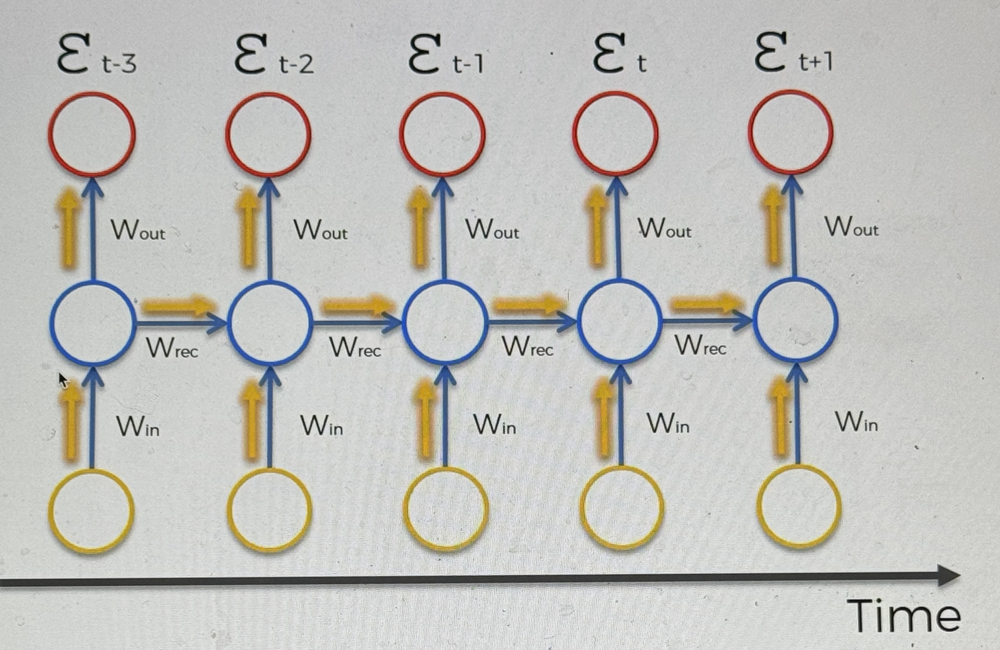
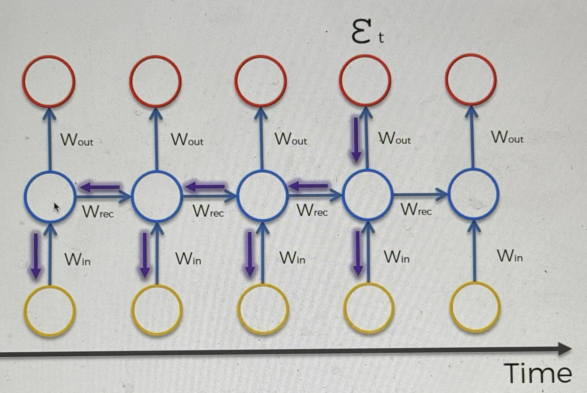

# Vanishing Gradient

This is a big problem with RNNs

so what is it?

### The problem

First discovered by Sepp Hochreiter in 1991

This is gradient descent, where we find the global min for our function

in a normal NN the info is sent through the network, and then the error is back propagated to update the weights

what happens in a RNN is similar, but there is some more stuff going on

when information travels through the RNN, it follows the path of the yellow arrows

it travels through time, and info from previous points also goes through the network

- each node isn't just 1 node, it is multiple nodes

at each point in time, you can calculate the cost function

and you have these cost function values throughout the timeseries

let's focus on the time t

- you have calculated the cost function at that time, so how will it work from here?

  - every single neuron that participated in finding this output, needs to be updated, but it's not just the neurons at this point in time, but all of the ones before it also

  

  - this is where the problem lies, you need to propagate and update all the way back through time
  - we have W_rec (weight recurring), this is the weight to connect the hidden layers to themselves to connect through the loop
    - in order to get from X_t-3 to X_t-2 you need to use W_rec
      - in simple terms you are just multiplying the output values by the weight to get to the next layer
    - W_rec can be set
  - this is where the problem arises
    - if your W_rec is small, then the gradient quickly gets much smaller as you go through the RNN
    - this is bad b/c the gradient is used to update the weights, and as it gets smaller it takes longer to update the weights at a lower time
      - makes it to where the layers closer to the left aren't properly trained, messing up the rest of the network

  

### Solutions

1. Exploding Gradient
   - Truncated Backpropagation
   - Penalties (artificial reduction)
   - Gradient Clipping (setting a max gradient value)
2. Vanishing Gradient
   - Weight initialization
   - Echo state networks
   - Long short term memory network (LSTMs)
