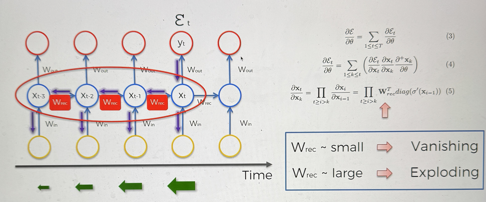
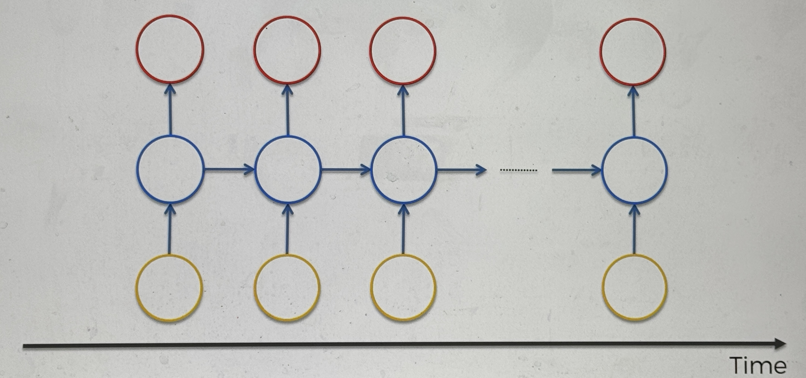
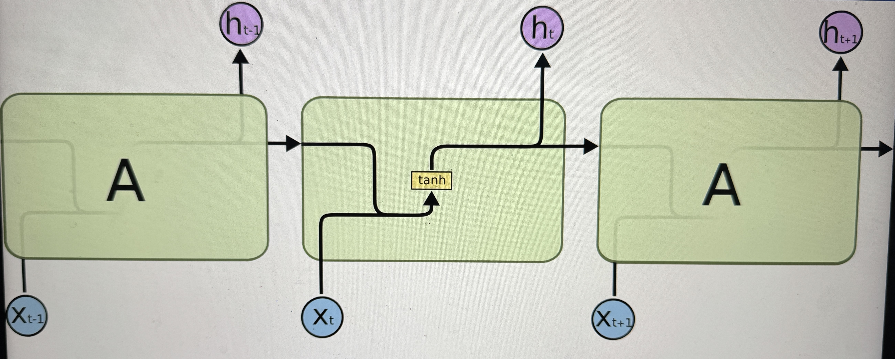
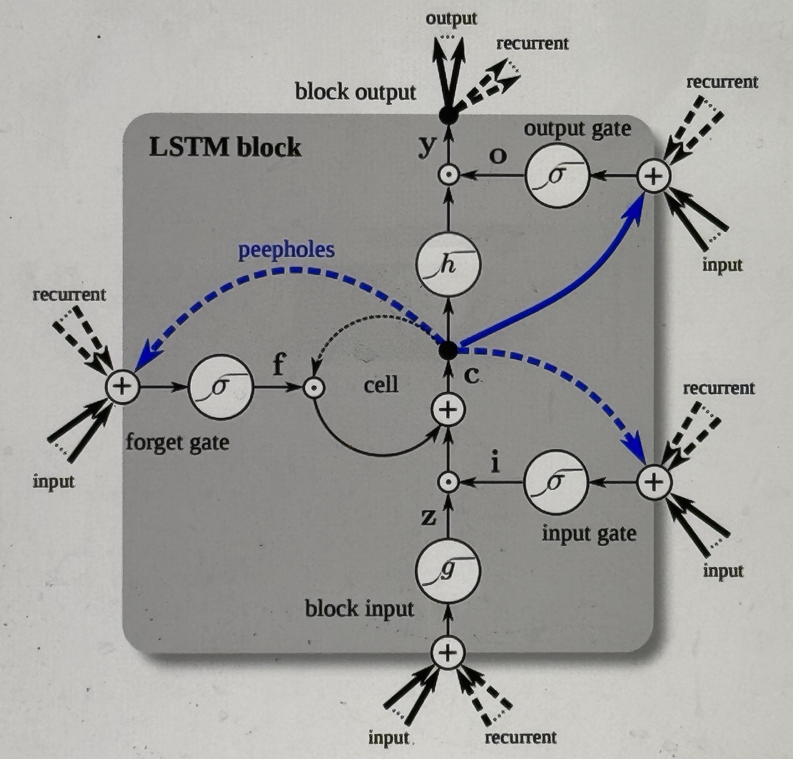
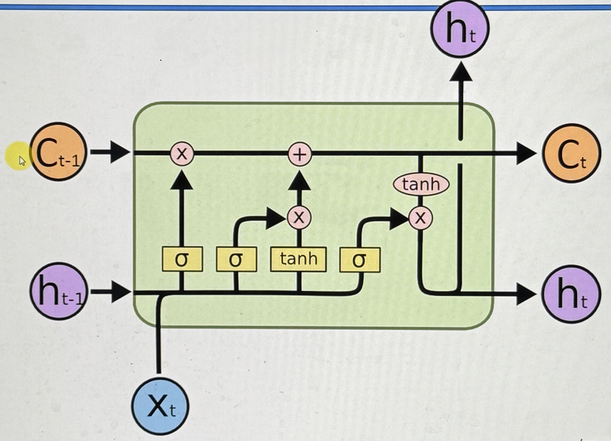
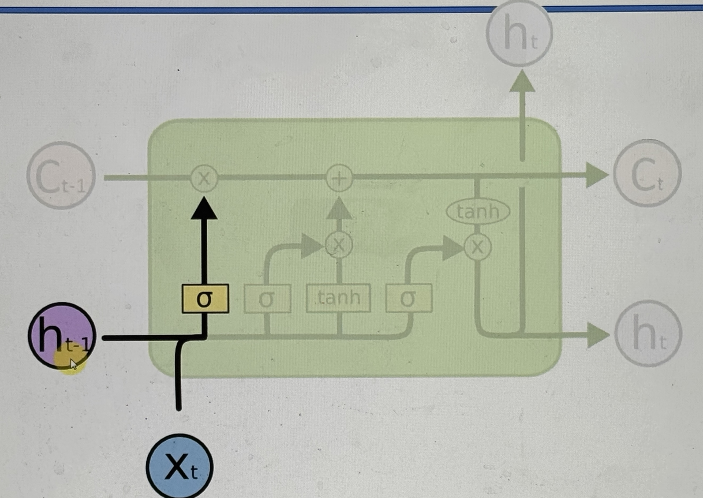
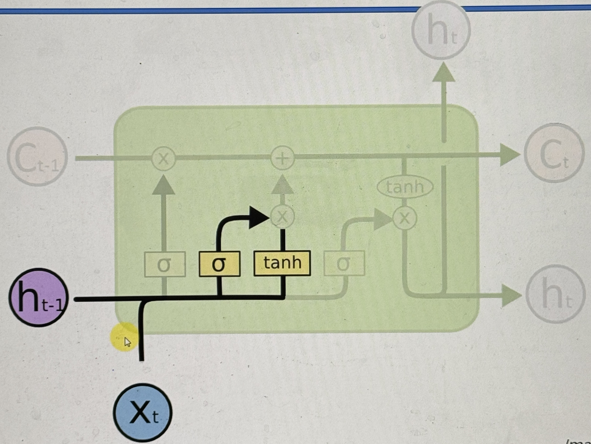
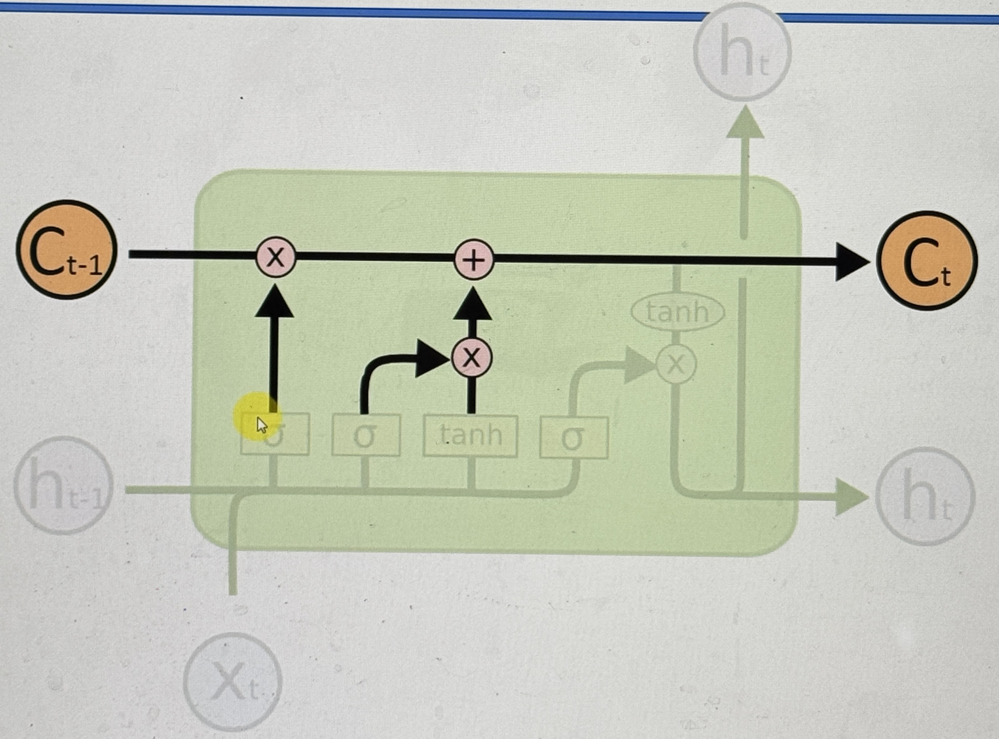
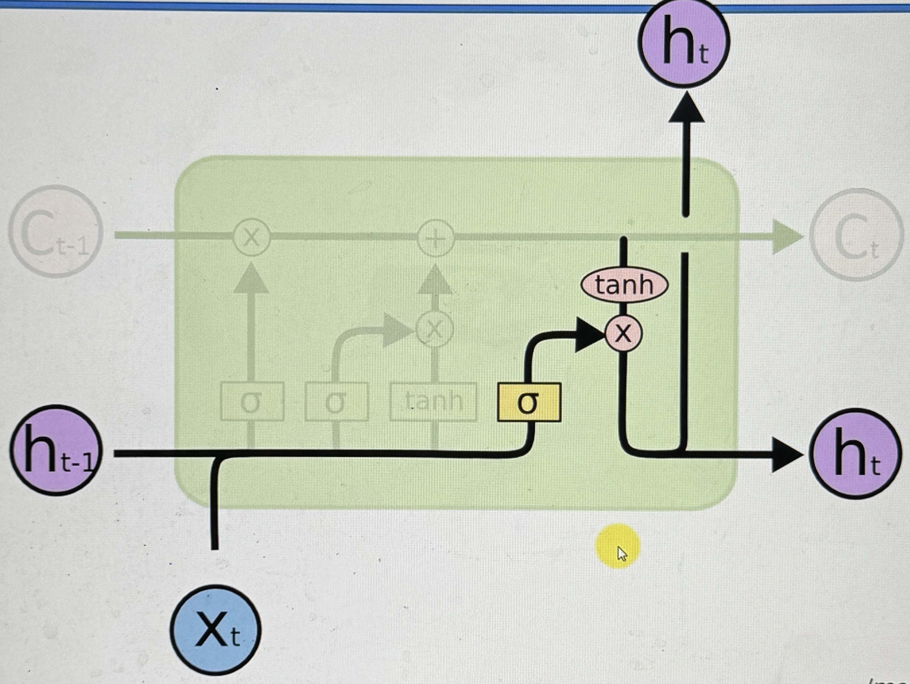

# Long Short Term Memory (LSTMs)

## History

Here we have the Vanishing Gradient Problem

- if Wrec < 1 then we have a vanishing gradient
- if Wrec > 1 then we have an exploding gradient

what is the first solution we can come up with to solve this issue?

- The first thing that comes to mind is make Wrec = 1

in general this is the idea, and that is all it takes

### Who are the people behind this?

- Sepp Hochreiter
- Jurgen Schmithubert

these 2 people introduced LSTMs in the 1990s, so now let's look at what they are

## Architecture

So here we have a RNN

This is what it would look like if you look inside an RNN

_[Here is a blog post describing LSTMs](https://colah.github.io/posts/2015-08-Understanding-LSTMs/)_

This is where the problem lies, as you have outputs coming into your module, the tanh operation is applied, and it keeps going. As you backpropagate, the gradient vanish.

This is what the LSTM version looks like:

This may seem complex, but this is a simplified display of LSTMs

_This is how they are normally shown, it is more convoluted_

going back to the simplified drawing:

- the pipeline at the top that goes through all of the hidden layers isn wrec = 1
  - LSTM-s have a memory pipeline, (the mentioned pipeline) this is to get rid of the vanishing gradient issue

Let's simplify the diagram even further (replacing the Hidden Layers on either side with something more simple)

- c : the memory cell
- h : the output
- x : the input
- t : the time

the LSTM has 3 inputs:

- ct-1
- ht-1
- xt

and has 2 outputs

- ct
- ht

The inputs and outputs are all vectors

- the arrows are vector transfers
- the converging arrows are concatonations
- the diverging arrows are just copies
- the grey dots are point wise operations
  - the x's are valves
    - they are controlled by the sigmoid layer operation (the sigmoid operation connected to the valve)
    - From left to right, the x's are
      - forget valve
      - memory valve
      - output valve
  - the + is just an addition to the memory
- the yellow rectangles are NN Layer Operations

## Example Walkthrough

### Step by step

1.   - New val, and val coming from previous node coming in, and they combine to decide whether the memory valve should be closed or open

2.  

- Then the same input vectors, combine to the sigmoid and the tanh layer operations, and the sigmoid function is used to define if the tanh operation will be added to the memory

3.  

- We have the memory flowing through, and the valves may be open or closed, to either keep the memory the same, added to, or completely changed
  - the Forget valve open, and the Memory valve closed
    - Memory stays the same
  - the Forget valve closed, Memory valve open
    - Memory changed completely
  - the Forget valve open, Memory valve open
    - Memory added to

4.  

- Finally we have the input vectors combined, to decide what part of the memory will be the output of the module
  - Could be fully, or partially

### Example

Google Translate

Let's say we are translating from english to czech

I am a _boy_ who likes to learn -> Jsem _kluk, který rád_ vydělává

I am a _girl_ who likes to learn -> Jsem _holka, která ráda_ vydělává

it is not just the word boy that changes to girl, there are 2 words after boy which change based on the gender of the noun

in this case, we would want to save the gendered word (boy or girl) in the memory

if the sentence changes from a male gendered noun, to a female gendered noun, then we the forget valve will trigger, deleting the memory pipeline, and the memory valve would open, pushing the new gendered words.

then the output valve will facilitate the extraction of the gender, and send it to the outputs
