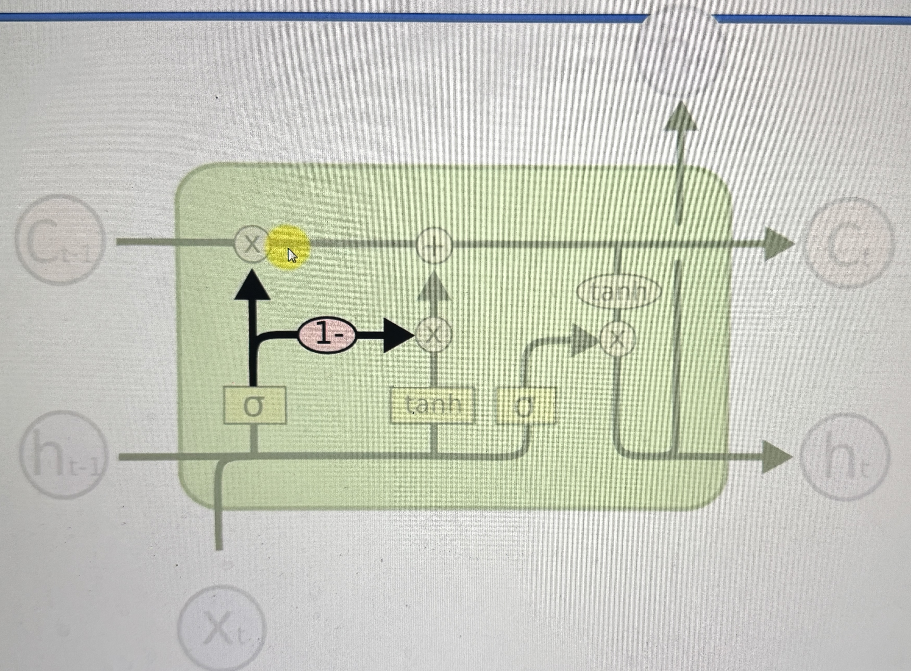
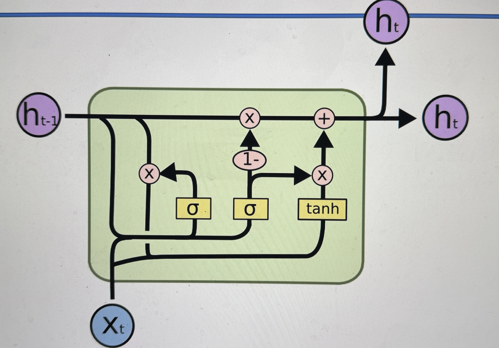

# LSTM Variations

## Standard LSTM that we have been going over

## Variation 1 - When peepholes are added

when the memory is also provided to the sigmoid functions

## Variation 2 - Connecting Forget and Memory valves

This is when the forget and memory valves are connected

- instead of having separate decisions for the forget and memory valves, now there is a combined decision
  - when the forget valve is closed, the memory valve is opened and vise versa
- depending on situation it makes sense to do this

## Variation 3 - Gated Recurring Units (GRUs)

Replace the memory pipeline with the hidden pipeline (ht)

- so instead of having 2 vector pipeline (memory [c] and the hidden [h] pipelines) it simplifies them into just 1 (the hidden vector pipeline)
- a bit less flexible

# Additional reading

There are more LSTM variations other than just the ones listed here

- [LSTM: A Search Space Odyssey](https://arxiv.org/pdf/1503.04069.pdf)
  - this covers more LSTM variations
