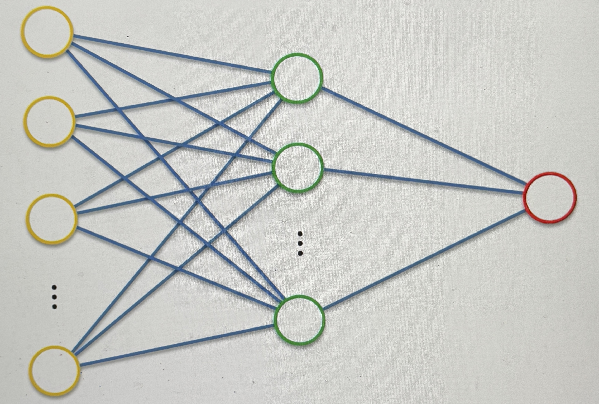
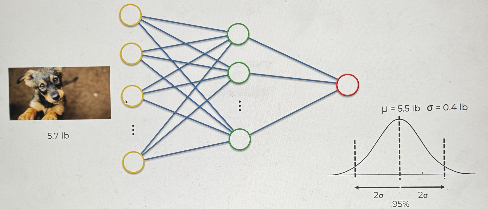
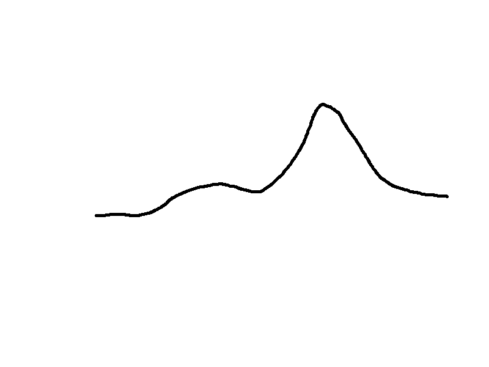
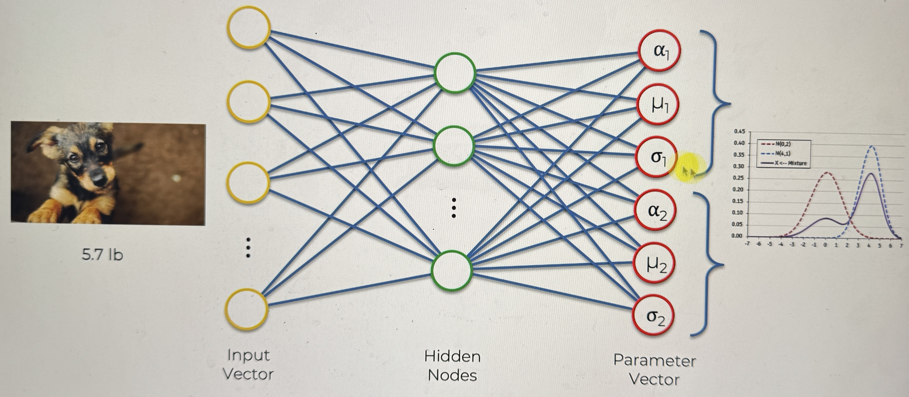

# Mixture Density Networks

Here we will assume we have a classic NN

Let's say that we have many images of puppies, and we want to train the NN to predict their weight based on the image given. this is a supervised problem (the image will have weights attached)

the info go through normally and predicts the weight, then the weights are adjusted through backpropagation, so that next time the predictions are more accurate

once the training is finished, the ANN would be able to predict relatively acurately the weight of a dog in the image

### This is where we will change it up a little bit

let's say that instead of outputting a deterministic value, we want our ANN to give us a range (a distribution of possible weights of the dog)

so instead of telling us that the weight is 5.5, it will give us a range where:

- the mean is 5.5 lbs
- the standard deviation is .4 lbs

why do we want this instead of a deterministic value?

- because is 1 standard deviation away, on either side of the mean, there is a 68% confidence that the dog is within the range
  - if it is 2 standard deviations away, then that number jumps to 95%

### How do we do this?

we want our ANN to output 2 values:

- the Mean
- the Standard Deviation

So instead of 1 output we will have 2

### what if the distribution is not a normal distribution?

what if the distribution is a general distribution?

what we will do in MDNs is an assumption that any general distribution can be broken down into a mixture of Gaussian/Normal Distributions

Like this:

based on that assumption, we now can upgrade our NN to look something like this:

so that the outputhas multiple sets of values for each distribution

- What are the alphas?
  - the weights at which the distributions are added to get our general distribution
  - like this:
    - $$ Mixture Model = \alpha_1 \times \text{Dist}\_1 + \alpha_2 \times \text{Dist}\_2 + ... + \alpha_i \times \text{Dist}\_i$$
      - Note: $$ \sum(\alpha_i) = 1 $$
      - the NN doesn't have to follow this, but the way that we get it to is using a soft-max function

This is what the final view would be like for a 2 distribution mixture model MDN

